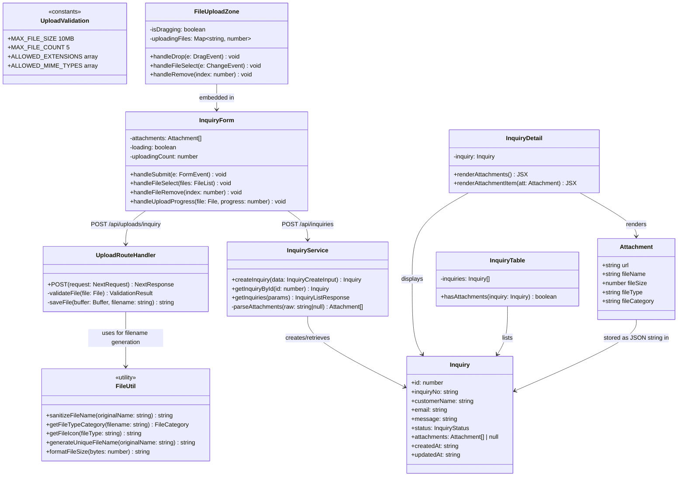
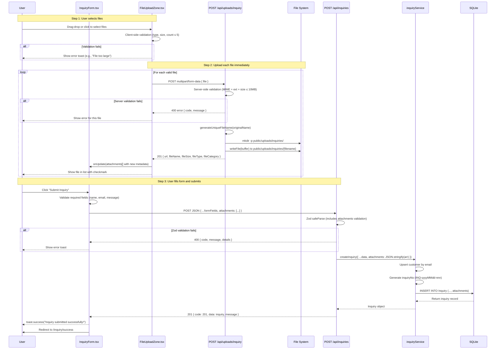
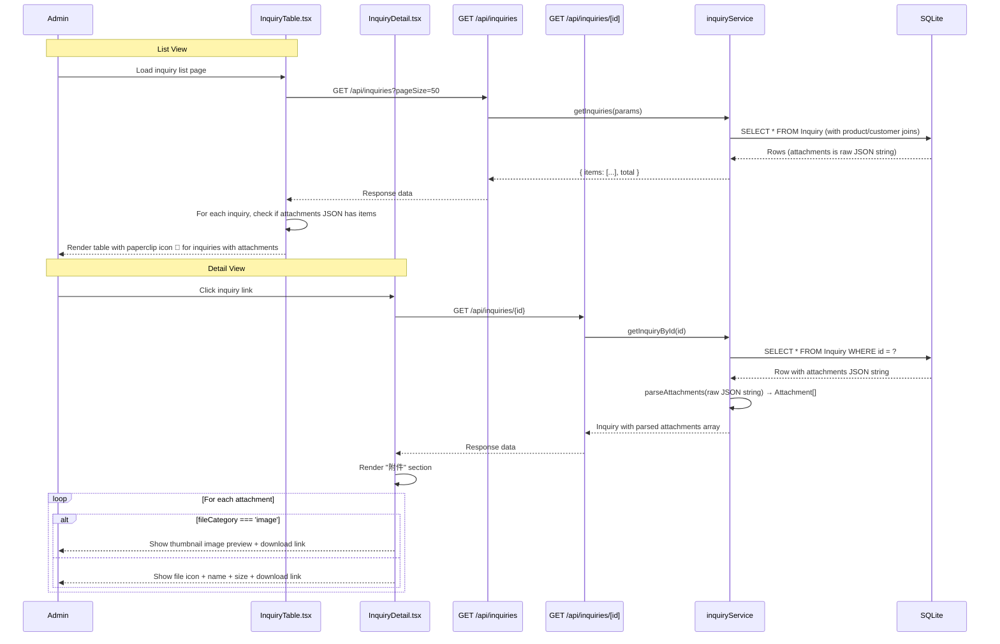
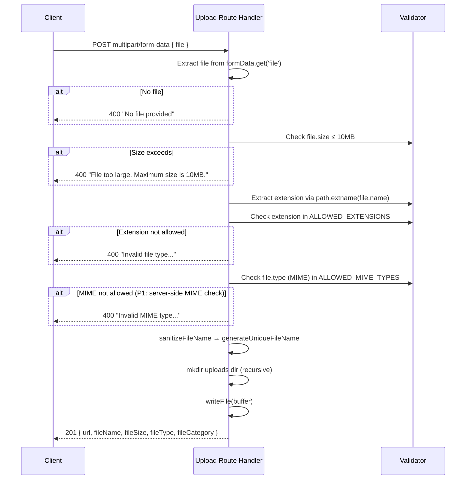
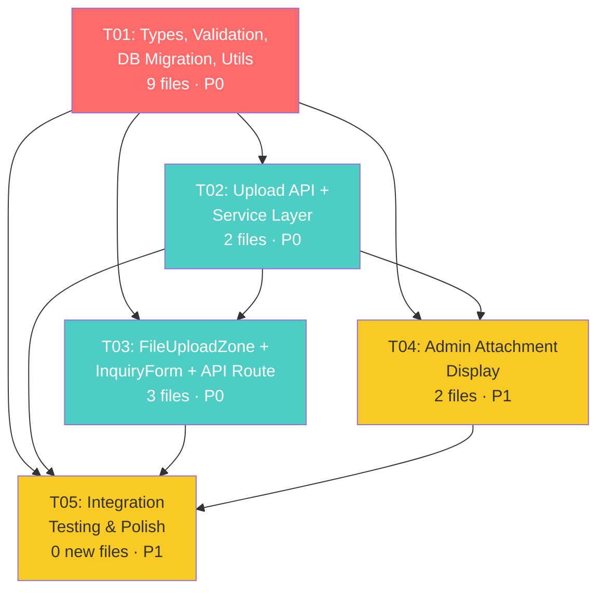

# Architecture Design: Inquiry File Upload Feature

> **Project**: TSIANFAN Website (qianfan-website)  
> **Tech Stack**: Next.js 14 App Router / TypeScript / Tailwind CSS / shadcn/ui / Prisma / SQLite  
> **Date**: 2026-08-04  
> **Author**: Architect (Bob/高见远)

---

## Table of Contents

1. [Implementation Approach](#1-implementation-approach)
2. [File List](#2-file-list)
3. [Data Structures and Interfaces](#3-data-structures-and-interfaces)
4. [Program Call Flow](#4-program-call-flow)
5. [Task Decomposition](#5-task-decomposition)
6. [Required Packages](#6-required-packages)
7. [Shared Knowledge](#7-shared-knowledge)
8. [Task Dependency Graph](#8-task-dependency-graph)
9. [Unclear / Assumptions](#9-unclear--assumptions)

---

## 1. Implementation Approach

### 1.1 Core Technical Challenges

| Challenge | Solution |
|-----------|----------|
| Multipart file upload in Next.js 14 App Router | Use native `request.formData()` API — no formidable/multer needed |
| File validation (type + size) on both client and server | Client: check `File.type` and `File.size` before upload; Server: validate MIME type via `file.type` + extension whitelist |
| Filename collision & path traversal security | Sanitize filename, generate `${timestamp}-${random}${ext}` pattern, use `path.extname()` only |
| DB schema change without `prisma generate` | Use raw SQL `ALTER TABLE Inquiry ADD COLUMN attachments TEXT;` via Python sqlite3 script |
| Upload UX: immediate upload vs. submit-time upload | Upload immediately on file selection → return metadata → form submit sends metadata array (decoupled flow) |
| Admin attachment display with download | Parse `attachments` JSON string → render file list with download links + image thumbnails |

### 1.2 Framework & Library Selection

| Component | Choice | Justification |
|-----------|--------|---------------|
| File upload handling | **Native Web API** (`request.formData()`, `file.arrayBuffer()`) | Next.js 14 App Router supports multipart natively; no extra deps needed. Existing `/api/admin/upload` route already uses this pattern. |
| File system writes | **`fs/promises`** (`writeFile`, `mkdir`) | Already used in existing upload routes; Node.js built-in, no dependency |
| Client-side validation | **Zod** (existing) + inline checks | Consistent with existing validation pattern |
| File type icons | **lucide-react** (existing) | Already installed; has File, FileImage, FileType, Paperclip icons |
| UI components | **shadcn/ui** (existing) | Consistent with existing component library |
| DB migration | **Python sqlite3** script | `prisma generate` is blocked in sandbox; same approach used for previous schema additions |

### 1.3 Architecture Pattern

The feature follows the existing **layered architecture** of the project:

```
┌─────────────────────────────────────────────────────────┐
│  Frontend (Client Components)                           │
│  ┌──────────────────┐  ┌──────────────────────────────┐ │
│  │ InquiryForm.tsx  │  │ InquiryDetail.tsx (admin)   │ │
│  │ + FileUploadZone │  │ + AttachmentList display     │ │
│  └────────┬─────────┘  └──────────────────────────────┘ │
│           │                                              │
│  ┌────────▼─────────┐                                    │
│  │ API Layer (Route Handlers)                           │
│  │  POST /api/uploads/inquiry  → save file, return meta │
│  │  POST /api/inquiries        → include attachments[]  │
│  │  GET  /api/inquiries/[id]   → return attachments     │
│  └────────┬─────────┘                                    │
│           │                                              │
│  ┌────────▼─────────┐                                    │
│  │ Service Layer                                         │
│  │  inquiryService.createInquiry() — now accepts         │
│  │  attachments JSON string                              │
│  └────────┬─────────┘                                    │
│           │                                              │
│  ┌────────▼─────────┐                                    │
│  │ Data Layer (Prisma/SQLite)                            │
│  │  Inquiry.attachments TEXT  (JSON array string)        │
│  └──────────────────┘                                    │
└─────────────────────────────────────────────────────────┘
```

### 1.4 Upload Flow Design (Immediate Upload)

```
User selects file
    ↓
Client validates (type, size, count)
    ↓
POST /api/uploads/inquiry (multipart/form-data, single file)
    ↓
Server validates again (MIME + extension + size)
    ↓
Server saves to public/uploads/inquiries/{timestamp}-{random}.{ext}
    ↓
Server returns { url, fileName, fileSize, fileType }
    ↓
Client stores metadata in state array
    ↓
[User clicks Submit]
    ↓
POST /api/inquiries (JSON, includes attachments[] metadata)
    ↓
Server stores JSON.stringify(attachments) in Inquiry.attachments column
```

**Key decision**: Upload happens immediately on file selection, NOT on form submit. This provides:
- Instant progress feedback per file
- Decoupled file storage from inquiry creation
- Simpler error recovery (retry individual file, not whole form)
- The inquiry form submit only sends the metadata array (already-uploaded file info)

---

## 2. File List

### 2.1 Files to CREATE (8 files)

| # | File Path | Description |
|---|-----------|-------------|
| 1 | `src/types/attachment.ts` | TypeScript type definitions for `Attachment` interface and file validation constants |
| 2 | `src/lib/validations/upload.ts` | Zod schema + validation constants for upload (allowed types, max size, max count) |
| 3 | `src/lib/utils/file.ts` | File utility functions: `sanitizeFileName()`, `getFileTypeCategory()`, `getFileIcon()` |
| 4 | `src/app/api/uploads/inquiry/route.ts` | **NEW API endpoint** `POST /api/uploads/inquiry` — handles single file upload, validates, saves to `public/uploads/inquiries/` |
| 5 | `src/components/inquiry/FileUploadZone.tsx` | **NEW client component** — drag-drop + file picker, progress bar, file list with remove button |
| 6 | `scripts/migrate-add-attachments.sql` | SQL migration script: `ALTER TABLE Inquiry ADD COLUMN attachments TEXT;` |
| 7 | `scripts/run-migrate-attachments.py` | Python script to execute the SQL migration against the SQLite DB |
| 8 | `public/uploads/inquiries/.gitkeep` | Placeholder to ensure upload directory exists in git |

### 2.2 Files to MODIFY (6 files)

| # | File Path | Changes |
|---|-----------|---------|
| 1 | `src/components/inquiry/InquiryForm.tsx` | Add `FileUploadZone` component, manage `attachments` state array, include `attachments` in POST body |
| 2 | `src/lib/validations/inquiry.ts` | Add `attachments` field to `inquiryCreateSchema` (optional Zod array of attachment objects) |
| 3 | `src/lib/services/inquiryService.ts` | Update `createInquiry()` to accept and persist `attachments` field; update `getInquiryById()` to parse attachments JSON |
| 4 | `src/types/inquiry.ts` | Add `attachments?: Attachment[]` field to `Inquiry` interface |
| 5 | `src/components/admin/InquiryDetail.tsx` | Add "附件" (Attachments) section: file list with icons, names, sizes, download links, image thumbnails |
| 6 | `src/components/admin/InquiryTable.tsx` | Add paperclip icon column for inquiries that have attachments |

### 2.3 Files UPDATED but NO code change (1 file)

| # | File Path | Notes |
|---|-----------|-------|
| 1 | `prisma/schema.prisma` | Add `attachments String?` field to Inquiry model for documentation/reference (actual DB change via raw SQL since `prisma generate` is blocked) |

---

## 3. Data Structures and Interfaces

### 3.1 Class Diagram



### 3.2 Type Definitions

#### `src/types/attachment.ts`

```typescript
/**
 * File category for icon display and grouping.
 */
export type FileCategory = 'image' | 'document' | 'cad' | 'other';

/**
 * Attachment metadata stored in the Inquiry.attachments JSON column.
 * Each element represents one uploaded file.
 */
export interface Attachment {
  /** Public URL path, e.g., "/uploads/inquiries/1700000000-abc123.pdf" */
  url: string;
  /** Original filename from user's system, e.g., "tile-spec.pdf" */
  fileName: string;
  /** File size in bytes */
  fileSize: number;
  /** File extension without dot, lowercase, e.g., "pdf" */
  fileType: string;
  /** Category for icon display: image | document | cad | other */
  fileCategory: FileCategory;
}

/**
 * Upload API response shape.
 */
export interface UploadResponse {
  url: string;
  fileName: string;
  fileSize: number;
  fileType: string;
  fileCategory: FileCategory;
}

/**
 * Upload progress state for a single file being uploaded.
 */
export interface UploadProgress {
  id: string;
  fileName: string;
  fileSize: number;
  progress: number; // 0-100
  status: 'uploading' | 'done' | 'error';
  error?: string;
  result?: Attachment;
}
```

#### Updated `src/types/inquiry.ts` (additions)

```typescript
import type { Attachment } from './attachment';

export interface Inquiry {
  // ... existing fields ...
  attachments: Attachment[] | null;  // <-- NEW: JSON-parsed array or null
  // ... rest ...
}
```

#### Updated `src/lib/validations/inquiry.ts` (additions)

```typescript
const attachmentSchema = z.object({
  url: z.string().min(1),
  fileName: z.string().min(1).max(255),
  fileSize: z.number().int().positive().max(10 * 1024 * 1024),
  fileType: z.string().min(1).max(20),
  fileCategory: z.enum(['image', 'document', 'cad', 'other']),
});

export const inquiryCreateSchema = z.object({
  // ... existing fields ...
  attachments: z.array(attachmentSchema).max(5).optional().default([]),
});
```

### 3.3 API Request/Response Shapes

#### `POST /api/uploads/inquiry` — Upload single file

**Request**: `multipart/form-data`
```
Content-Type: multipart/form-data
Body: file=<binary>
```

**Success Response** (201):
```json
{
  "code": 201,
  "data": {
    "url": "/uploads/inquiries/1700000000-abc123pdf.pdf",
    "fileName": "tile-spec.pdf",
    "fileSize": 12345,
    "fileType": "pdf",
    "fileCategory": "document"
  },
  "message": "File uploaded"
}
```

**Error Response** (400):
```json
{
  "code": 400,
  "message": "Invalid file type. Allowed: jpg, png, webp, gif, pdf, doc, docx, xls, xlsx, ppt, pptx, dwg, dxf, txt, csv",
  "details": { "file": ["File type .exe is not allowed"] }
}
```

#### `POST /api/inquiries` — Create inquiry (modified)

**Request** (JSON):
```json
{
  "customerName": "John Doe",
  "email": "john@example.com",
  "message": "I need a quote for tile display racks...",
  "attachments": [
    {
      "url": "/uploads/inquiries/1700000000-abc123pdf.pdf",
      "fileName": "tile-spec.pdf",
      "fileSize": 12345,
      "fileType": "pdf",
      "fileCategory": "document"
    }
  ]
}
```

**Response** (201): Same as before, `data` now includes `attachments` array.

#### `GET /api/inquiries/[id]` — Get inquiry detail (modified)

**Response** now includes parsed `attachments` array:
```json
{
  "code": 200,
  "data": {
    "id": 1,
    "inquiryNo": "INQ-20260804-001",
    "attachments": [
      {
        "url": "/uploads/inquiries/1700000000-abc123pdf.pdf",
        "fileName": "tile-spec.pdf",
        "fileSize": 12345,
        "fileType": "pdf",
        "fileCategory": "document"
      }
    ]
  }
}
```

### 3.4 Database Schema Change

```sql
-- Raw SQL (executed via Python sqlite3 script, NOT prisma migrate)
ALTER TABLE Inquiry ADD COLUMN attachments TEXT;
```

**Prisma schema** (updated for documentation/reference only):
```prisma
model Inquiry {
  // ... existing fields ...
  attachments    String?  // JSON array string: [{"url":"...","fileName":"...","fileSize":123,"fileType":"pdf","fileCategory":"document"}]
  // ... rest ...
}
```

---

## 4. Program Call Flow

### 4.1 File Upload + Inquiry Submit Sequence



### 4.2 Admin Views Inquiry with Attachments



### 4.3 File Upload Validation Logic (Server-Side)



---

## 5. Task Decomposition

### 5.1 Required Packages

No new npm packages are needed. The feature uses exclusively existing dependencies:

| Package | Version | Purpose | Status |
|---------|---------|---------|--------|
| `next` | ^14.2.3 | App Router, `request.formData()` API | ✅ Already installed |
| `zod` | ^3.23.8 | Schema validation | ✅ Already installed |
| `lucide-react` | ^0.395.0 | File/Paperclip/FileImage icons | ✅ Already installed |
| `sonner` | ^1.5.0 | Toast notifications | ✅ Already installed |
| `fs/promises` | Node.js built-in | File system operations | ✅ Built-in |
| `path` | Node.js built-in | Path manipulation | ✅ Built-in |

> **Note**: The existing `/api/admin/upload` and `/api/admin/upload-file` routes already demonstrate the exact pattern (native `request.formData()` → `file.arrayBuffer()` → `Buffer.from()` → `writeFile`). No `formidable`, `multer`, or `busboy` needed.

### 5.2 Task List

#### T01: Project Infrastructure — Types, Validation Constants, DB Migration, Upload Utils

**Source Files:**
- `src/types/attachment.ts` (CREATE)
- `src/lib/validations/upload.ts` (CREATE)
- `src/lib/utils/file.ts` (CREATE)
- `scripts/migrate-add-attachments.sql` (CREATE)
- `scripts/run-migrate-attachments.py` (CREATE)
- `public/uploads/inquiries/.gitkeep` (CREATE)
- `prisma/schema.prisma` (MODIFY — add `attachments String?` to Inquiry model)
- `src/types/inquiry.ts` (MODIFY — add `attachments` field)
- `src/lib/validations/inquiry.ts` (MODIFY — add `attachments` to schema)

**Dependencies:** None  
**Priority:** P0

**Description:**
This task establishes all foundational infrastructure:
1. Create `Attachment` type interface, `FileCategory` type, `UploadResponse` and `UploadProgress` interfaces
2. Create upload validation constants: `ALLOWED_EXTENSIONS`, `ALLOWED_MIME_TYPES`, `MAX_FILE_SIZE` (10MB), `MAX_FILE_COUNT` (5), and a Zod `attachmentSchema`
3. Create file utility functions: `sanitizeFileName()`, `getFileTypeCategory()`, `generateUniqueFileName()`, `getFileIconName()`
4. Create SQL migration script and Python runner to `ALTER TABLE Inquiry ADD COLUMN attachments TEXT`
5. Update Prisma schema (documentation) and TypeScript types
6. Update Zod inquiry schema to accept optional `attachments` array
7. Create the `.gitkeep` file in `public/uploads/inquiries/`
8. **Run** the migration script to apply the DB change

---

#### T02: Upload API Endpoint — Server-Side File Handling

**Source Files:**
- `src/app/api/uploads/inquiry/route.ts` (CREATE)
- `src/lib/services/inquiryService.ts` (MODIFY — `createInquiry` accepts attachments, `getInquiryById` parses attachments JSON)

**Dependencies:** T01  
**Priority:** P0

**Description:**
1. Create `POST /api/uploads/inquiry` route handler:
   - Accept `multipart/form-data` via `request.formData()`
   - Extract `file` from formData
   - Server-side validation: extension whitelist, MIME type whitelist, file size ≤ 10MB
   - Generate sanitized unique filename: `${Date.now()}-${randomString}${ext}`
   - Save to `public/uploads/inquiries/` (mkdir recursive)
   - Return `{ code: 201, data: { url, fileName, fileSize, fileType, fileCategory }, message }`
   - This is a **public** endpoint (no `requireAdmin` — customers upload files before they have an account)
2. Modify `inquiryService.createInquiry()`:
   - Accept `attachments?: Attachment[]` in the data parameter
   - Store as `JSON.stringify(attachments)` in the `attachments` column
   - Use `prisma.$executeRawUnsafe` or `prisma.inquiry.create` with raw field if Prisma client doesn't recognize the new column
3. Modify `inquiryService.getInquiryById()`:
   - Parse `attachments` JSON string into `Attachment[]` array (or return `[]` if null/empty)
   - Use `safeJsonParse()` from existing utils

---

#### T03: Frontend Upload Component — FileUploadZone + InquiryForm Integration

**Source Files:**
- `src/components/inquiry/FileUploadZone.tsx` (CREATE)
- `src/components/inquiry/InquiryForm.tsx` (MODIFY)
- `src/app/api/inquiries/route.ts` (MODIFY — accept `attachments` in POST body)

**Dependencies:** T01, T02  
**Priority:** P0

**Description:**
1. Create `FileUploadZone` client component:
   - Drag-and-drop zone with dashed border (toggles highlight on dragenter/dragleave)
   - Hidden `<input type="file" multiple>` triggered by click
   - Accept attribute: `.jpg,.jpeg,.png,.webp,.gif,.pdf,.doc,.docx,.xls,.xlsx,.ppt,.pptx,.dwg,.dxf,.txt,.csv`
   - Client-side validation before upload (type, size ≤ 10MB, count ≤ 5)
   - Per-file upload progress (use `XMLHttpRequest` for progress events, or show indeterminate spinner)
   - File list display: icon (based on category), original filename, formatted size, remove (X) button
   - Image files show thumbnail preview (use `URL.createObjectURL()`)
   - Upload state: `uploading` (spinner/progress), `done` (green check), `error` (red X + retry)
   - Props: `attachments: Attachment[]`, `onAttachmentsChange: (attachments: Attachment[]) => void`
2. Modify `InquiryForm.tsx`:
   - Import and render `<FileUploadZone>` below the message textarea, above the submit button
   - Add `attachments` state: `const [attachments, setAttachments] = useState<Attachment[]>([])`
   - Include `attachments` in the POST body to `/api/inquiries`
   - Disable submit button while any file is still uploading
3. Modify `POST /api/inquiries` route:
   - The Zod schema already validates `attachments` (from T01)
   - Pass `attachments` through to `inquiryService.createInquiry()`

---

#### T04: Admin Attachment Display — InquiryDetail + InquiryTable

**Source Files:**
- `src/components/admin/InquiryDetail.tsx` (MODIFY)
- `src/components/admin/InquiryTable.tsx` (MODIFY)

**Dependencies:** T01, T02  
**Priority:** P1

**Description:**
1. Modify `InquiryDetail.tsx`:
   - Add a new "附件" (Attachments) Card section (Chinese label, consistent with admin UI language)
   - Only render the section if `inquiry.attachments && inquiry.attachments.length > 0`
   - For each attachment:
     - If `fileCategory === 'image'`: show thumbnail preview (img tag with `imgUrl()`, max-w-32, rounded)
     - Else: show file icon (lucide-react: `FileText`, `FileImage`, `FileType`, `File`)
     - Show original filename + formatted file size
     - Download link: `<a href={attachment.url} download={attachment.fileName} target="_blank">`
     - Download icon button (lucide-react `Download`)
   - Use existing `formatFileSize()` from `src/lib/utils.ts`
2. Modify `InquiryTable.tsx`:
   - Add a column or inline indicator for attachments
   - Parse `inq.attachments` (string from API — need to check if it's already parsed by service or raw)
   - If attachments exist, show a `Paperclip` icon (lucide-react) next to the inquiry number
   - The icon serves as a visual indicator that the inquiry has files

---

#### T05: Integration Testing & Polish

**Source Files:**
- All files from T01–T04 (verification, no new files)

**Dependencies:** T01, T02, T03, T04  
**Priority:** P1

**Description:**
1. Verify DB migration applied successfully:
   - Run `python scripts/run-migrate-attachments.py`
   - Confirm `attachments` column exists in SQLite Inquiry table
2. End-to-end test of upload flow:
   - Select image file → verify thumbnail appears → verify upload succeeds
   - Select PDF file → verify file icon appears → verify upload succeeds
   - Select invalid file (.exe) → verify client-side rejection
   - Select file > 10MB → verify client-side rejection
   - Select 6th file when 5 already uploaded → verify count limit message
3. End-to-end test of inquiry submit:
   - Submit form with attachments → verify inquiry created in DB
   - Submit form without attachments → verify inquiry still works (backward compatible)
4. Admin verification:
   - View inquiry list → verify paperclip icon appears for inquiries with attachments
   - Click inquiry → verify "附件" section displays with correct files
   - Click download link → verify file downloads
   - Verify image thumbnails render correctly
5. TypeScript type-check: `npm run type-check` — no errors
6. Build check: `npm run build` — no errors

---

### 5.3 Task Summary Table

| Task | Name | Files | Deps | Priority |
|------|------|-------|------|----------|
| T01 | Types, Validation, DB Migration, Utils | 9 files (6 create, 3 modify) | — | P0 |
| T02 | Upload API + Service Layer | 2 files (1 create, 1 modify) | T01 | P0 |
| T03 | FileUploadZone + InquiryForm + API Route | 3 files (1 create, 2 modify) | T01, T02 | P0 |
| T04 | Admin Attachment Display | 2 files (0 create, 2 modify) | T01, T02 | P1 |
| T05 | Integration Testing & Polish | 0 new files (verification) | T01–T04 | P1 |

---

## 6. Shared Knowledge

### 6.1 File Validation Rules (Client + Server)

```typescript
// Single source of truth: src/lib/validations/upload.ts

export const MAX_FILE_SIZE = 10 * 1024 * 1024; // 10 MB
export const MAX_FILE_COUNT = 5;

export const ALLOWED_EXTENSIONS = [
  // Images
  '.jpg', '.jpeg', '.png', '.webp', '.gif',
  // Documents
  '.pdf', '.doc', '.docx', '.xls', '.xlsx', '.ppt', '.pptx',
  // CAD
  '.dwg', '.dxf',
  // Others
  '.txt', '.csv',
] as const;

export const ALLOWED_MIME_TYPES = [
  'image/jpeg', 'image/png', 'image/webp', 'image/gif',
  'application/pdf',
  'application/msword', 'application/vnd.openxmlformats-officedocument.wordprocessingml.document',
  'application/vnd.ms-excel', 'application/vnd.openxmlformats-officedocument.spreadsheetml.sheet',
  'application/vnd.ms-powerpoint', 'application/vnd.openxmlformats-officedocument.presentationml.presentation',
  'text/plain', 'text/csv',
  'application/acad', 'application/dwg', 'application/dxf',
  // Some browsers report CAD files as octet-stream; allow as fallback if extension matches
  'application/octet-stream',
] as const;
```

### 6.2 File Category Mapping

```typescript
// src/lib/utils/file.ts

export function getFileTypeCategory(filename: string): FileCategory {
  const ext = path.extname(filename).toLowerCase().slice(1);
  if (['jpg', 'jpeg', 'png', 'webp', 'gif'].includes(ext)) return 'image';
  if (['pdf', 'doc', 'docx', 'xls', 'xlsx', 'ppt', 'pptx', 'txt', 'csv'].includes(ext)) return 'document';
  if (['dwg', 'dxf'].includes(ext)) return 'cad';
  return 'other';
}
```

### 6.3 File Path Convention

- **Storage directory**: `public/uploads/inquiries/`
- **URL path**: `/uploads/inquiries/{filename}` (no `/public` prefix — Next.js serves `public/` at root)
- **Filename pattern**: `{timestamp}-{randomString}{extension}` — e.g., `1722787200000-a3f8b2c1.pdf`
- **DB storage**: `Inquiry.attachments` column stores `JSON.stringify(Attachment[])` — a TEXT column containing a JSON array string
- **Git tracking**: `public/uploads/inquiries/` is gitignored (user uploads should not be committed). Only `.gitkeep` is tracked.

### 6.4 API Response Format

All API responses follow the existing `{ code, data, message }` format via `successResponse()` / `errorResponse()` / `createdResponse()` from `src/types/api.ts`.

### 6.5 Upload Endpoint is PUBLIC

The `POST /api/uploads/inquiry` endpoint does **NOT** require `requireAdmin` — it's a public endpoint accessible by website visitors. This is intentional: customers upload files before submitting the inquiry form, and they don't have admin accounts.

However, to prevent abuse:
- File type/size validation is strict (server-side)
- Rate limiting is a P2 concern (not in scope for this iteration)

### 6.6 Backward Compatibility

- The `attachments` field is optional in the Zod schema (`z.array(attachmentSchema).max(5).optional().default([])`)
- Existing inquiries without attachments will have `null` in the `attachments` column
- `inquiryService.getInquiryById()` parses `null` as `[]` (empty array)
- The `InquiryForm` works without any files selected (backward compatible)
- The admin `InquiryDetail` only renders the "附件" section if `attachments.length > 0`

### 6.7 Prisma Client Note

Since `prisma generate` is blocked in the sandbox, the `attachments` column added via raw SQL may not be recognized by the Prisma client's TypeScript types. The service layer should use `prisma.$executeRawUnsafe` / `prisma.$queryRawUnsafe` for writes involving the `attachments` column, or cast the Prisma result to include the field. The existing codebase already uses this pattern for incremental models (see `schema.prisma` lines 301-306).

### 6.8 File Icon Mapping (lucide-react)

| Category | Extension(s) | Icon Component |
|----------|-------------|----------------|
| image | jpg, png, webp, gif | `FileImage` |
| document (pdf) | pdf | `FileText` |
| document (word) | doc, docx | `FileText` |
| document (excel) | xls, xlsx | `FileSpreadsheet` |
| document (ppt) | ppt, pptx | `FileText` |
| cad | dwg, dxf | `File` |
| other | txt, csv | `FileText` |

---

## 7. Task Dependency Graph



**Critical Path**: T01 → T02 → T03 → T05 (P0 tasks must complete sequentially)

**Parallelizable**: T03 and T04 can be developed in parallel after T01 and T02 are complete (they touch different files).

---

## 8. Unclear / Assumptions

### Assumptions Made

1. **Upload progress tracking**: Using `XMLHttpRequest` for per-file upload progress (not `fetch`, which doesn't support progress events). If progress is deemed non-critical, a simple spinner per file is acceptable as fallback.

2. **CAD file MIME types**: Browsers often report `.dwg` / `.dxf` files as `application/octet-stream` rather than a specific CAD MIME type. The server validates by **extension** first, then checks MIME — if MIME is `application/octet-stream` but extension is in the whitelist, the file is accepted.

3. **Orphaned files**: If a user uploads files but never submits the form, the files remain on disk as orphans. Per the PRD decision ("File retention: Keep indefinitely, no auto-cleanup"), this is acceptable. A cleanup script is a P2 future enhancement.

4. **File download via `<a>` tag**: Download links use plain `<a href={url} download={fileName}>` — no separate download API endpoint needed since files are in `public/` and directly served by Next.js.

5. **Prisma client and raw column**: The Prisma client may not include `attachments` in its TypeScript types since `prisma generate` is blocked. The service layer handles this by either:
   - Using `$queryRawUnsafe` for reads and casting the result
   - Using `prisma.inquiry.create()` and passing `attachments` as a raw field via `as any` cast
   - The exact approach depends on whether the Prisma client tolerates unknown fields (it typically does for SQLite with raw SQL columns)

### Items to Clarify

1. **Rate limiting on upload endpoint**: The public `POST /api/uploads/inquiry` endpoint has no rate limiting. Should we add a simple IP-based rate limit (e.g., max 20 uploads per IP per 10 minutes)? **Assumption: Not in scope for this iteration (P2).**

2. **Virus scanning**: No malware scanning is performed on uploaded files. For a B2B website accepting CAD files, this may be a concern. **Assumption: Not in scope — file types are restricted to known-safe extensions.**

3. **File content-type spoofing**: A user could rename a `.exe` to `.pdf` and upload it. The server checks both MIME type and extension, but MIME types can also be spoofed. **Assumption: Acceptable risk for current scope — the file whitelist excludes executable types, and the server validates the extension.**

4. **Concurrent uploads from same user**: If a user opens multiple tabs with the inquiry form, they could theoretically upload more than 5 files across tabs. **Assumption: The 5-file limit is enforced per-form (client-side state), not per-session. This is acceptable.**

---

## Appendix A: File Validation Constants (Complete Reference)

```
Allowed file types:
  Images:     .jpg .jpeg .png .webp .gif
  Documents:  .pdf .doc .docx .xls .xlsx .ppt .pptx
  CAD:        .dwg .dxf
  Others:     .txt .csv

Limits:
  Max file size:  10 MB (10,485,760 bytes)
  Max file count: 5 files per inquiry
```

## Appendix B: Existing Upload Patterns Referenced

The project already has two upload routes that demonstrate the exact pattern to follow:

1. **`src/app/api/admin/upload/route.ts`** — Image upload (admin-only, 5MB limit, applies watermark, registers to MediaLibrary)
2. **`src/app/api/admin/upload-file/route.ts`** — Document upload (admin-only, 50MB limit, saves to `public/uploads/files/`)

The new `POST /api/uploads/inquiry` route follows the same pattern but:
- Is **public** (no `requireAdmin`)
- Saves to `public/uploads/inquiries/`
- Has a 10MB limit
- Supports a broader file type whitelist (including CAD)
- Does NOT register to MediaLibrary (inquiry attachments are separate from the media library)
- Does NOT apply watermark
