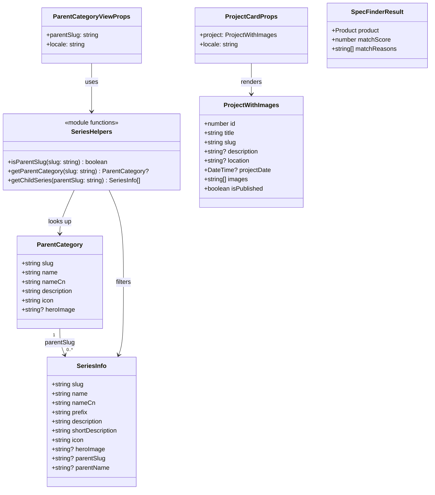
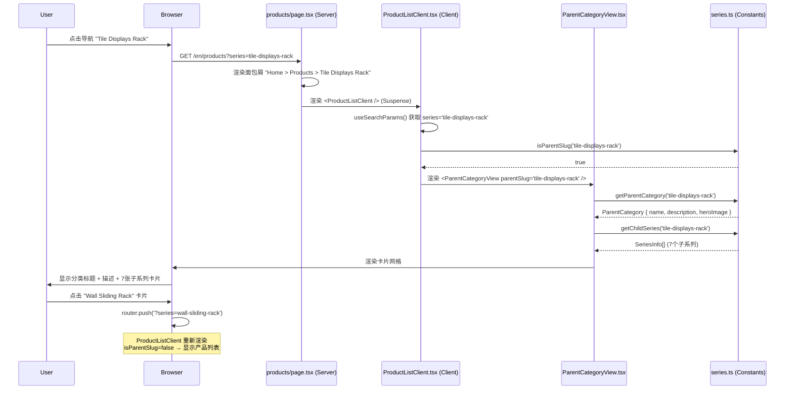
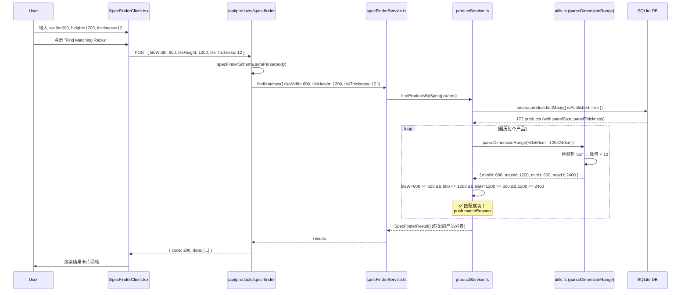
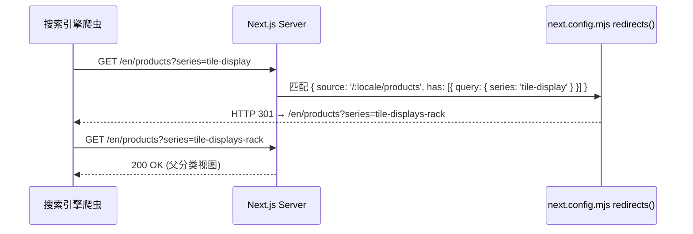
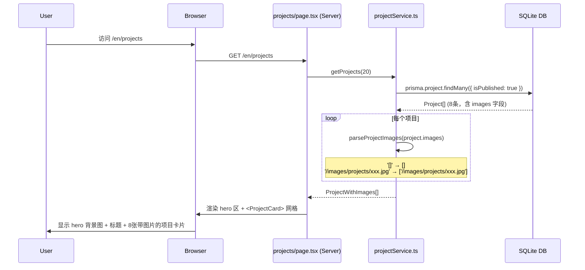
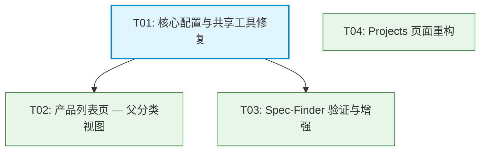

# 架构设计文档: 产品列表页 UX 优化与页面修复

> 文档版本: v1.0  
> 日期: 2026-08-04  
> 关联 PRD: `docs/PRD-ProductListing-UX.md`  
> 项目: qianfan-website (Next.js 14 + TypeScript + Tailwind + shadcn/ui + Prisma + SQLite)

---

## 目录

1. [实现方案 + 框架选型](#1-实现方案--框架选型)
2. [文件列表及相对路径](#2-文件列表及相对路径)
3. [数据结构和接口](#3-数据结构和接口)
4. [程序调用流程](#4-程序调用流程)
5. [任务列表](#5-任务列表)
6. [共享知识（跨文件约定）](#6-共享知识跨文件约定)
7. [待明确事项](#7-待明确事项)

---

## 1. 实现方案 + 框架选型

### 1.1 技术挑战分析

| 需求 | 核心挑战 | 解决方案 |
|------|----------|----------|
| P0-1 旧 slug 重定向 | Next.js redirects 不直接支持 query string 匹配 | 使用 `has` 条件匹配 `query` 类型，在 `next.config.mjs` 中硬编码 6 条 301 规则 |
| P0-2 父分类视图 | 需要在同一个 `/products` 路由下根据 `?series` 参数切换两种完全不同的视图（父分类卡片网格 vs 产品列表） | 在 `ProductListClient` 中增加条件分支：检测 `series` 是否匹配 `PARENT_CATEGORIES` slug，是则渲染 `<ParentCategoryView />`，否则渲染现有的产品列表 |
| P0-3 spec-finder 修复 | **已定位根因**：DB 中 `panelSize` 使用厘米(cm)存储（如 `60x60cm - 120x240cm`），而用户输入为毫米(mm)（如 `600x1200mm`）。`parseDimensionRange()` 提取数值后未做单位转换，导致 `600 >= 60 && 600 <= 120` 永远为 false | 修复 `parseDimensionRange()` 函数：检测字符串中是否包含 `cm`，若是则将提取的数值乘 10 转换为 mm |
| P0-4 projects 页重构 | Project 模型已有 `images` 字段(`String?`)，但数据格式不统一（部分为 `'[]'` JSON 空数组，部分为单个 URL 字符串）；当前页面卡片无图片区域 | 在 `projectService` 中增加解析逻辑（兼容 JSON 数组和单 URL 格式），在 projects 页面新增 hero 区和带图片的卡片 |

### 1.2 框架与库选型

本项目为已有 Next.js 14 项目的增量改造，**无需引入新框架**。所有改动基于现有技术栈：

- **Next.js 14 App Router**: 利用 `redirects()` 配置实现 301 重定向；利用 Server Component + Client Component 混合渲染
- **Tailwind CSS**: 响应式卡片网格布局（`grid-cols-1 md:grid-cols-2 lg:grid-cols-3 xl:grid-cols-4`）
- **shadcn/ui**: 复用现有 `Card`、`Badge`、`Button` 组件
- **Prisma + SQLite**: 通过 `$queryRawUnsafe` 进行原始 SQL 查询（沙箱中 `prisma generate` 不可用）
- **Zod**: 现有 schema 验证（`specFinderSchema`）

### 1.3 架构模式

沿用项目现有的 **Server Component → Service Layer → Prisma/DB** 三层架构：

```
Server Component (page.tsx)
    ↓ 调用
Service Layer (productService / projectService)
    ↓ 查询
Prisma ($queryRawUnsafe) / SQLite DB

Client Component (ProductListClient / SpecFinderClient)
    ↓ fetch
API Route (/api/products, /api/products/spec-finder)
    ↓ 调用
Service Layer → Prisma → DB
```

父分类视图是纯静态数据（从 `SERIES_INFO` 常量中筛选），无需 API 调用，在 Client Component 中直接渲染。

---

## 2. 文件列表及相对路径

### 2.1 需修改的文件

| # | 文件路径 | 改动类型 | 说明 |
|---|----------|----------|------|
| 1 | `next.config.mjs` | 修改 | 在 `redirects()` 中添加 6 条旧 slug 301 重定向规则 |
| 2 | `src/lib/utils.ts` | 修改 | 修复 `parseDimensionRange()` 函数：增加 cm→mm 单位转换逻辑 |
| 3 | `src/lib/constants/series.ts` | 修改 | 添加 3 个辅助函数：`isParentSlug()`, `getParentCategory()`, `getChildSeries()` |
| 4 | `src/app/[locale]/(marketing)/products/page.tsx` | 修改 | 父分类视图的面包屑和标题动态化 |
| 5 | `src/app/[locale]/(marketing)/products/ProductListClient.tsx` | 修改 | 增加 parent slug 检测逻辑，条件渲染 `<ParentCategoryView />` |
| 6 | `src/app/[locale]/(marketing)/spec-finder/SpecFinderClient.tsx` | 修改 | 增强：错误状态展示、无结果引导文案优化 |
| 7 | `src/app/api/products/spec-finder/route.ts` | 修改 | 增加 GET handler 返回预设数据，优化错误响应 |
| 8 | `src/lib/services/specFinderService.ts` | 修改 | 增加防御性检查和日志 |
| 9 | `src/app/[locale]/(marketing)/projects/page.tsx` | 修改 | 新增 hero 区，卡片增加图片缩略图 |
| 10 | `src/lib/services/projectService.ts` | 修改 | `getProjects()` 返回解析后的 images 数组 |

### 2.2 需新建的文件

| # | 文件路径 | 说明 |
|---|----------|------|
| 11 | `src/components/product/ParentCategoryView.tsx` | 父分类落地页组件：子系列卡片网格 |
| 12 | `src/components/projects/ProjectCard.tsx` | 项目卡片组件：含图片缩略图 |

---

## 3. 数据结构和接口

### 3.1 类图



### 3.2 关键数据结构定义

#### ParentCategoryView 组件 Props

```typescript
interface ParentCategoryViewProps {
  parentSlug: string;       // 父分类 slug，如 'tile-displays-rack'
  locale: string;           // 当前语言，如 'en'
}
```

组件内部从 `SERIES_INFO` 常量中筛选 `parentSlug === parentSlug` 的子系列，无需 API 调用。

#### ProjectWithImages（projects 页使用）

```typescript
interface ProjectWithImages {
  id: number;
  title: string;
  slug: string;
  description: string | null;
  location: string | null;
  projectDate: string | null;
  images: string[];          // 解析后的图片 URL 数组（可能为空）
  isPublished: boolean;
}
```

`images` 字段解析逻辑（在 `projectService.getProjects()` 中完成）：
1. 若 `images` 为 `null` 或空字符串 → 返回 `[]`
2. 尝试 `JSON.parse()`：若成功且为数组 → 返回该数组
3. 若 `JSON.parse()` 失败 → 视为单个 URL 字符串，返回 `[images]`

#### SpecFinderResult（已有，无需修改）

```typescript
interface SpecFinderResult {
  product: Product;
  matchScore: number;
  matchReasons: string[];
}
```

### 3.3 辅助函数签名（series.ts 新增）

```typescript
/** 检查 slug 是否为父分类 slug */
export function isParentSlug(slug: string): boolean;

/** 根据 slug 获取父分类信息 */
export function getParentCategory(slug: string): ParentCategory | undefined;

/** 获取指定父分类下的所有子系列 */
export function getChildSeries(parentSlug: string): SeriesInfo[];
```

---

## 4. 程序调用流程

### 4.1 产品列表页 — 父分类视图渲染流程



### 4.2 Spec-Finder 搜索流程（修复后）



### 4.3 旧 Slug 重定向流程



### 4.4 Projects 页渲染流程（重构后）



---

## 5. 任务列表

### 5.1 所需第三方包

无需新增任何第三方包。所有功能基于现有依赖实现。

### 5.2 任务分解

| 序号 | 任务名称 | 涉及文件 | 依赖 | 优先级 | 描述 |
|------|----------|----------|------|--------|------|
| T01 | 核心配置与共享工具修复（基础设施） | `next.config.mjs`<br>`src/lib/utils.ts`<br>`src/lib/constants/series.ts` | 无 | P0 | 1. 在 `next.config.mjs` 的 `redirects()` 中添加 6 条旧 slug 301 重定向规则（使用 `has` 条件匹配 query string）<br>2. 修复 `parseDimensionRange()` 函数：检测字符串中是否含 `cm`，若是则将解析数值 ×10 转换为 mm，解决 spec-finder 单位不匹配 bug<br>3. 在 `series.ts` 中新增 3 个辅助函数：`isParentSlug(slug)`、`getParentCategory(slug)`、`getChildSeries(parentSlug)`，供产品列表页和过滤面板使用 |
| T02 | 产品列表页 — 父分类视图 | `src/app/[locale]/(marketing)/products/page.tsx`<br>`src/app/[locale]/(marketing)/products/ProductListClient.tsx`<br>`src/components/product/ParentCategoryView.tsx` (新建) | T01 | P0 | 1. 修改 `page.tsx`：根据 `searchParams.series` 动态生成面包屑（Home > Products > 父分类名）和页面标题<br>2. 修改 `ProductListClient.tsx`：增加条件分支——当 `isParentSlug(series)` 为 true 时渲染 `<ParentCategoryView />`，否则保持现有产品列表<br>3. 新建 `ParentCategoryView.tsx`：从 `getChildSeries(parentSlug)` 获取子系列数据，渲染卡片网格（图片 + 名称 + 描述 + 链接），响应式布局 1/2/3-4 列 |
| T03 | Spec-Finder 验证与增强 | `src/app/[locale]/(marketing)/spec-finder/SpecFinderClient.tsx`<br>`src/app/api/products/spec-finder/route.ts`<br>`src/lib/services/specFinderService.ts` | T01 | P0 | 1. 验证 T01 中 `parseDimensionRange` 修复后 spec-finder 功能正常（API + 前端）<br>2. 在 `SpecFinderClient.tsx` 中增加 fetch 错误状态展示（catch 块显示错误消息而非静默清空）<br>3. 在 `route.ts` 中增加 GET handler 返回 thickness options 和 size presets（供 SSR 渲染）<br>4. 在 `specFinderService.ts` 中增加参数防御性检查和 console.warn 日志 |
| T04 | Projects 页面重构 | `src/app/[locale]/(marketing)/projects/page.tsx`<br>`src/lib/services/projectService.ts`<br>`src/components/projects/ProjectCard.tsx` (新建) | 无 | P0 | 1. 修改 `projectService.ts`：在 `getProjects()` 中解析 `images` 字段为 `string[]` 数组（兼容 JSON 数组和单 URL 格式），返回 `ProjectWithImages[]`<br>2. 新建 `ProjectCard.tsx`：卡片组件，顶部图片区域（4:3 比例，无图时显示渐变占位符）+ 标题 + 描述 + location/date meta<br>3. 修改 `projects/page.tsx`：新增 hero 区（渐变背景 + 居中标题/描述），使用 `<ProjectCard>` 替换现有内联卡片渲染 |

### 5.3 任务依赖图



**并行执行说明**：
- T01 是基础任务，必须最先完成（T02 和 T03 依赖其产出）
- T02 和 T03 可并行执行（互相独立）
- T04 与 T01/T02/T03 完全独立，可任意时间并行执行

---

## 6. 共享知识（跨文件约定）

### 6.1 PARENT_CATEGORIES 在 Server/Client 之间的传递

- **常量文件** `src/lib/constants/series.ts` 是纯 TypeScript 常量模块，**无** `'use client'` 指令
- 该文件同时可在 Server Component 和 Client Component 中 import（纯数据 + 纯函数，无副作用）
- **不需通过 props 传递**：Client Component 直接 import `SERIES_INFO`、`PARENT_CATEGORIES` 和辅助函数
- **不需 API 调用**：父分类视图是静态数据，从常量中筛选即可

### 6.2 子系列卡片图片来源

- 优先使用 `SERIES_INFO[i].heroImage`（如 `/images/products/CT011.jpg`）
- 这些图片路径是 public 目录下的静态文件，使用 Next.js `<Image>` 组件或 `` 标签
- 若 `heroImage` 不存在（理论上不会，因为所有 17 个子系列都有 `heroImage`），fallback 到父分类的 `heroImage`
- 图片比例统一 4:3，使用 Tailwind `aspect-[4/3]` + `object-cover`

### 6.3 Projects images 字段格式

DB 中 `Project.images` 字段（`String?` 类型）实际存储格式不统一：

| 格式 | 示例 | 出现的项目 |
|------|------|------------|
| JSON 空数组字符串 | `'[]'` | Project ID 1, 2, 3 |
| 单个 URL 字符串 | `'/images/projects/stone-slab-showroom-paris.jpg'` | Project ID 4, 5, 6, 7, 8 |

**解析策略**（在 `projectService.getProjects()` 中统一处理）：
```typescript
function parseProjectImages(imagesStr: string | null): string[] {
  if (!imagesStr || imagesStr.trim() === '') return [];
  // 尝试 JSON 解析
  try {
    const parsed = JSON.parse(imagesStr);
    if (Array.isArray(parsed)) return parsed.filter(Boolean);
    if (typeof parsed === 'string') return [parsed];
  } catch {
    // 非 JSON，视为单个 URL
    return [imagesStr];
  }
  return [];
}
```

- 解析后返回 `string[]`，前端根据数组长度决定显示图片或占位符
- 无图片的项目卡片显示渐变色占位区域（`bg-gradient-to-br from-gray-200 to-gray-300`）

### 6.4 旧 Slug 重定向规则

在 `next.config.mjs` 的 `redirects()` 中使用 `has` 条件匹配 query string：

```javascript
{
  source: '/:locale/products',
  has: [{ type: 'query', key: 'series', value: 'tile-display' }],
  destination: '/:locale/products?series=tile-displays-rack',
  permanent: true, // HTTP 301
}
```

**已确认的 6 条重定向映射**：

| 旧 slug | 新 slug | 说明 |
|---------|---------|------|
| `tile-display` | `tile-displays-rack` | 瓷砖展示架 |
| `stone-display` | `stone-displays-rack` | 石材展示架 |
| `wood-flooring-display` | `wooden-flooring-display-rack` | 木地板展示架 |
| `sample-cabinet` | `samples-box-books-display` | 样品箱册 |
| `mosaic-decor` | `mosaic-display-rack` | 马赛克展示架 |
| `other-display` | 无对应父分类 | 重定向到 `/:locale/products`（全部产品页） |

> **注意**：`other-display` 无对应新父分类，重定向到不带 `?series` 参数的产品列表页。

### 6.5 parseDimensionRange 修复细节

当前 bug 根因：

```
DB panelSize: "60x60cm - 120x240cm"
parseDimensionRange() 提取: minW=60, minH=60, maxW=120, maxH=240 (单位: cm)
用户输入: tileWidth=600, tileHeight=1200 (单位: mm)

比较: 600 >= 60 ✓ 但 600 <= 120 ✗ → 永远不匹配
```

修复方案：在 `parseDimensionRange()` 中检测 `cm` 后缀，将提取的数值乘 10：

```typescript
// 在 return 之前
const isCm = /cm/i.test(rangeStr);
const multiplier = isCm ? 10 : 1;
return {
  minW: parseInt(match[1], 10) * multiplier,
  minH: parseInt(match[2], 10) * multiplier,
  maxW: parseInt(match[3], 10) * multiplier,
  maxH: parseInt(match[4], 10) * multiplier,
};
```

同样的转换需应用于 single dimension 匹配分支。

### 6.6 API 响应格式约定

所有 API 响应遵循现有 `{ code, data, message }` 格式：
- `code: 200` 表示成功
- `code: 400/500` 表示错误，`data` 中包含 `fieldErrors` 或 `null`

SpecFinderClient 已正确处理此格式：
```typescript
if (data.code === 200) {
  setResults(data.data || []);
}
```

---

## 7. 待明确事项

### 7.1 已确认事项

| # | 问题 | 答案 |
|---|------|------|
| 1 | 旧 slug 完整列表 | 已确认 6 个：`tile-display`, `stone-display`, `wood-flooring-display`, `sample-cabinet`, `mosaic-decor`, `other-display` |
| 2 | Projects 图片字段 | Prisma schema 中 Project 模型已有 `images` 字段（`String?` 类型），DB 中 8 条项目数据：3 条 images 为 `'[]'`，5 条为单 URL。无需 schema 变更。 |
| 3 | spec-finder bug 根因 | 已定位：`parseDimensionRange()` 未做 cm→mm 单位转换，导致所有匹配比较失败。API route 和 SpecFinderClient 代码逻辑本身正确。 |

### 7.2 假设与风险

1. **假设**：`other-display` 重定向到 `/products`（无 series 参数）是可接受的。如果 SEO 团队有更好的目标页，可后续调整。
2. **风险**：`parseDimensionRange()` 修复后，可能影响其他使用该函数的地方。经检查，该函数仅在 `productService.findProductsBySpec()` 中使用，影响范围可控。
3. **假设**：projects 页 hero 区背景图使用已有静态图片（如 `/images/projects/hero-bg.jpg`），若该文件不存在则使用 CSS 渐变作为 fallback。
4. **风险**：Next.js `redirects()` 中使用 `has` 条件匹配 query string 时，`source` 需包含 `:locale` 参数段以匹配多语言路由。需测试确认 redirect 在 `/en/products?series=tile-display` 和 `/fr/products?series=tile-display` 等路径下均生效。

---

## 附：文件变更摘要

```
MODIFIED (10 files):
  next.config.mjs                                     — +6 redirect rules
  src/lib/utils.ts                                    — parseDimensionRange cm→mm fix
  src/lib/constants/series.ts                         — +3 helper functions
  src/app/[locale]/(marketing)/products/page.tsx      — dynamic breadcrumb/title
  src/app/[locale]/(marketing)/products/ProductListClient.tsx — parent view conditional render
  src/app/[locale]/(marketing)/spec-finder/SpecFinderClient.tsx — error state + UX
  src/app/api/products/spec-finder/route.ts           — +GET handler
  src/lib/services/specFinderService.ts               — defensive checks
  src/app/[locale]/(marketing)/projects/page.tsx       — hero + ProjectCard
  src/lib/services/projectService.ts                  — images parsing

NEW (2 files):
  src/components/product/ParentCategoryView.tsx        — sub-series card grid
  src/components/projects/ProjectCard.tsx              — project card with image
```
