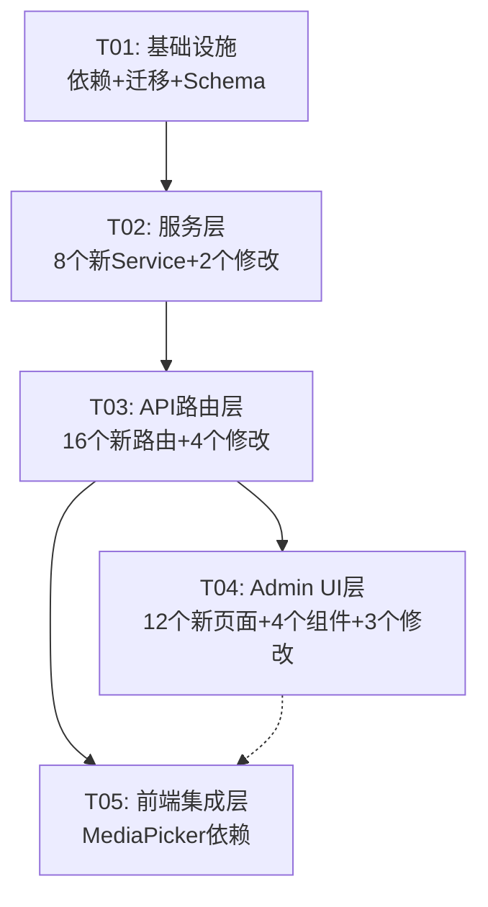
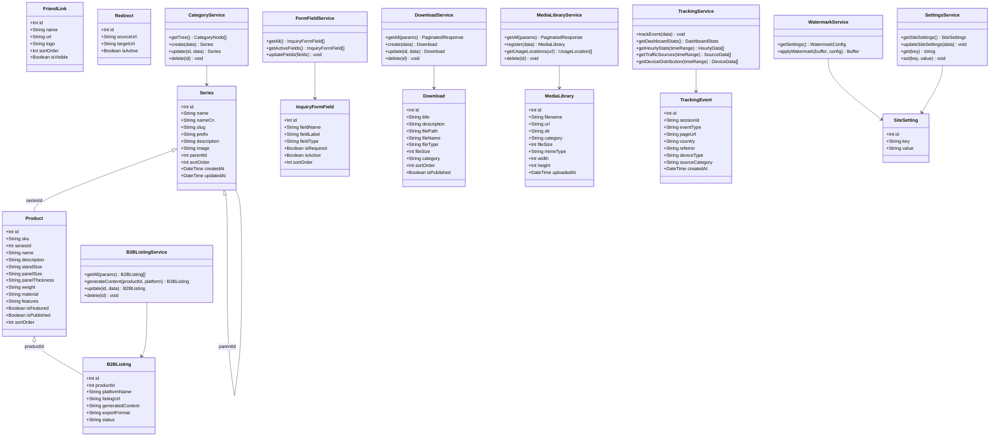
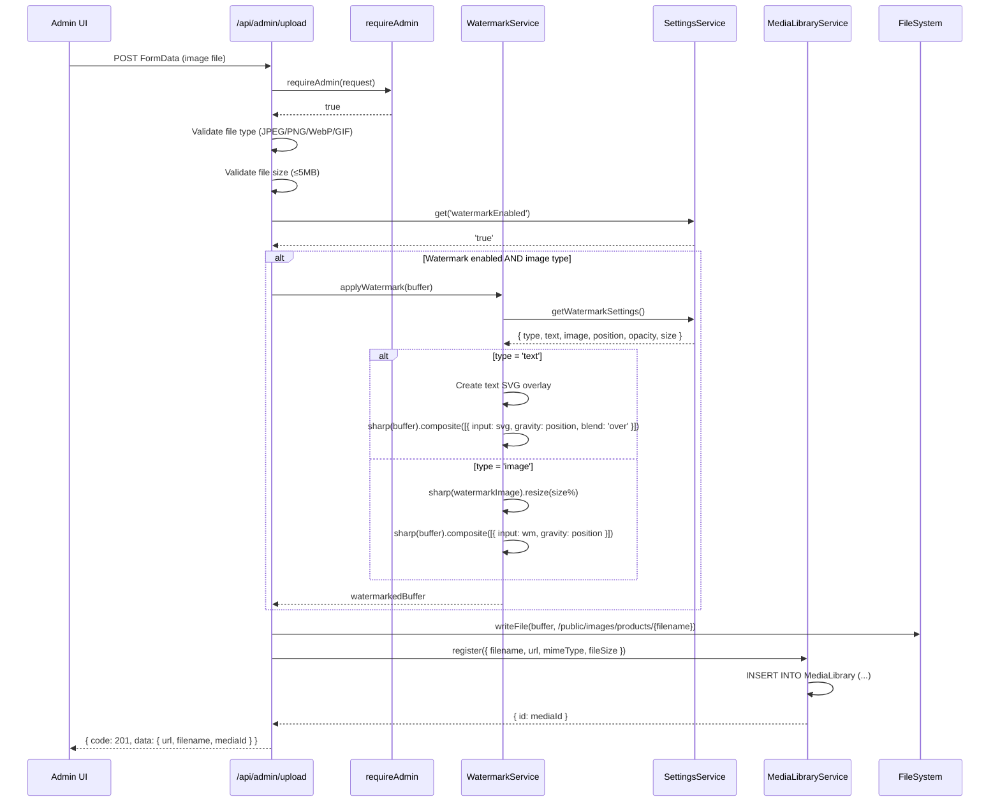
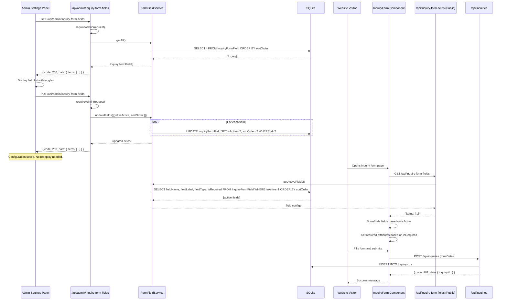
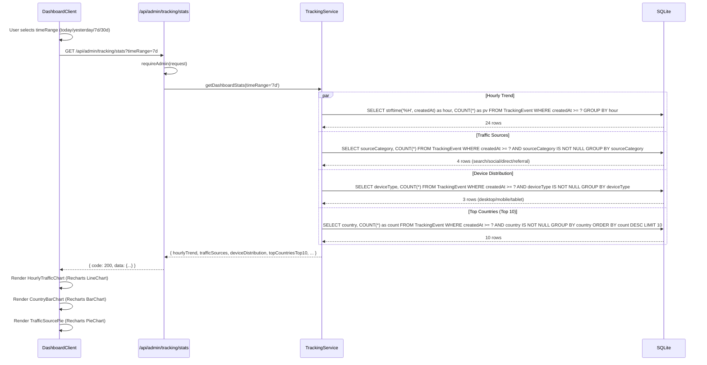

# TSIANFAN 英文官网增量开发 — 系统架构设计文档

> 基于 PRD-UEESHOP-Features.md 中用户勾选的验收项，为 TSIANFAN 官网增量开发设计系统架构与任务分解。

---

## 目录

1. [实现方案 + 框架选型](#1-实现方案--框架选型)
2. [数据模型设计](#2-数据模型设计)
3. [文件列表](#3-文件列表)
4. [API 路由设计](#4-api-路由设计)
5. [任务列表](#5-任务列表)
6. [共享知识](#6-共享知识)
7. [待明确事项](#7-待明确事项)
8. [Mermaid 图](#8-mermaid-图)

---

## 1. 实现方案 + 框架选型

### 1.1 整体技术方案概述

本次增量开发基于现有 Next.js 14 App Router + TypeScript + Tailwind CSS + shadcn/ui + Prisma + SQLite 技术栈，不引入新的框架级依赖，仅在图表渲染和图片处理两个领域新增轻量级库。

**核心架构约束**：`prisma generate` 在 sandbox 中被阻止，现有 Prisma Client 仅包含已生成的模型。因此：

- **现有模型**（Product, Inquiry, Series, TrackingEvent 等）：继续使用 Prisma Client 类型化方法
- **新增模型**（InquiryFormField, Download, FriendLink, Redirect, MediaLibrary, B2BListing）：全部使用 `prisma.$queryRawUnsafe` / `prisma.$executeRawUnsafe` 原生 SQL 操作，与现有 `settingsService.ts` 模式一致
- **现有模型新增字段**（TrackingEvent 新增 referrer/deviceType/sourceCategory, Series 新增 parentId）：通过 `ALTER TABLE` 添加列，读写这些字段时使用原生 SQL

**架构分层**：

```
Admin UI (page.tsx + Client Component)
    ↓ SWR / fetch
API Routes (route.ts) — requireAdmin 鉴权
    ↓
Service Layer (xxxService.ts) — 业务逻辑 + 原生 SQL
    ↓
Prisma Client ($queryRawUnsafe / $executeRawUnsafe)
    ↓
SQLite (scripts/qianfan-seed2.db)
```

### 1.2 新增依赖包

| 包名 | 版本 | 用途 | 选型理由 |
|------|------|------|----------|
| `recharts` | `^2.12.0` | Dashboard 图表可视化（折线图/柱状图/饼图）| React 原生组件，SSR 友好，API 简洁，PRD 明确推荐；包体积 ~100KB gzipped，可接受 |
| `sharp` | `^0.33.0` | 图片水印处理（composite 合成）| Node.js 生态最成熟的图片处理库，Next.js 内部已依赖；支持 PNG/JPEG/WebP 格式，性能优异 |
| `@types/recharts` | — | Recharts TypeScript 类型（已内置于 recharts 包，无需单独安装）| recharts ^2.12 自带类型定义 |

**不引入的库及原因**：

| 库 | 原因 |
|----|------|
| papaparse / csv-parse | P0-04 产品批量上传不在本期范围 |
| react-quill / @tiptap/react | P0-01 博客系统不在本期范围 |
| Chart.js / D3 | Recharts 更轻量且 React 集成更好 |
| express-middleware | 301 重定向 middleware 执行不在本期范围 |

### 1.3 框架/库选型详细说明

#### 图表库：Recharts

- **场景**：P1-01 Dashboard 需要三种图表 — 24 小时访问量折线图、国家/地区柱状图（Top 10）、流量来源饼图
- **选型**：Recharts ^2.12.0
- **理由**：
  - React 原生组件式 API（`<LineChart>`, `<BarChart>`, `<PieChart>`），与现有 shadcn/ui 组件风格一致
  - 支持 SSR（服务端渲染返回空容器，客户端 hydrate 后渲染图表）
  - `ResponsiveContainer` 自动适配容器宽度，无需手动计算
  - TypeScript 类型完备
- **使用约定**：所有图表组件必须加 `'use client'` 指令，用 `ResponsiveContainer` 包裹

#### 图片处理：Sharp

- **场景**：P1-04 产品图片上传时自动添加水印（文字或图片）
- **选型**：sharp ^0.33.0
- **理由**：
  - Node.js 原生 C++ 绑定，性能远超 Canvas/Jimp 等纯 JS 方案
  - `sharp(image).composite([{ input: watermark, gravity: 'southeast' }])` 一行实现水印合成
  - 支持透明度（alpha channel）、位置（9 宫格 gravity）、缩放
  - Next.js 内部已使用 sharp 做 `next/image` 优化，安装不会增加额外体积
- **使用约定**：仅在服务端 API Route 中使用（不能在客户端组件中使用）

---

## 2. 数据模型设计

### 2.1 新增 Prisma 模型定义

> 以下模型定义写入 `prisma/schema.prisma` 仅作文档记录。由于 `prisma generate` 被阻止，实际 CRUD 操作全部通过 `prisma.$queryRawUnsafe` / `prisma.$executeRawUnsafe` 执行原生 SQL。建表 DDL 写入 `scripts/migrate-additional-tables.sql`。

#### 2.1.1 InquiryFormField（询盘表单字段配置 — P0-05）

```prisma
/// 询盘表单字段配置。fieldName 映射到 Inquiry 模型的字段名。
/// fieldType 取值: text | email | number | tel | textarea | select
model InquiryFormField {
  id          Int      @id @default(autoincrement())
  fieldName   String   @unique   // 映射到 Inquiry 模型字段名: customerName, email, phone, company, country, quantity, message
  fieldLabel  String              // 前端显示标签
  fieldType   String   @default("text")  // text | email | number | tel | textarea | select
  isRequired  Boolean  @default(false)
  isActive    Boolean  @default(true)
  sortOrder   Int      @default(0)
  createdAt   DateTime @default(now())
  updatedAt   DateTime @updatedAt
}
```

**默认种子数据**（7 个字段，对应现有 Inquiry 模型）：

| fieldName | fieldLabel | fieldType | isRequired | isActive | sortOrder |
|-----------|-----------|-----------|------------|----------|-----------|
| customerName | Name | text | true | true | 1 |
| email | Email | email | true | true | 2 |
| phone | Phone | tel | false | true | 3 |
| company | Company | text | false | true | 4 |
| country | Country | text | false | true | 5 |
| quantity | Quantity | number | false | true | 6 |
| message | Message | textarea | true | true | 7 |

#### 2.1.2 Download（下载资源 — P1-02）

```prisma
/// 下载资源管理。仅后台 CRUD，不做前端下载页。
/// category 取值: catalog | specification | manual | certificate | other
model Download {
  id          Int      @id @default(autoincrement())
  title       String
  description String?
  filePath    String              // 相对路径，如 /uploads/downloads/xxx.pdf
  fileName    String              // 原始文件名
  fileType    String              // MIME type: application/pdf, application/msword, etc.
  fileSize    Int                 // 文件大小（字节）
  category    String   @default("other")  // catalog | specification | manual | certificate | other
  sortOrder   Int      @default(0)
  isPublished Boolean  @default(true)
  createdAt   DateTime @default(now())
  updatedAt   DateTime @updatedAt
}
```

#### 2.1.3 FriendLink（友情链接 — P1-03）

```prisma
/// 友情链接管理。仅后台 CRUD，不做前端 Footer 展示。
model FriendLink {
  id         Int      @id @default(autoincrement())
  name       String
  url        String
  logo       String?             // Logo 图片 URL（可选）
  sortOrder  Int      @default(0)
  isVisible  Boolean  @default(true)
  createdAt  DateTime @default(now())
  updatedAt  DateTime @updatedAt
}
```

#### 2.1.4 Redirect（301 重定向规则 — P1-05）

```prisma
/// 301 重定向规则管理。仅后台 CRUD，不做 middleware 执行跳转。
model Redirect {
  id         Int      @id @default(autoincrement())
  sourceUrl  String   @unique    // 源 URL 路径
  targetUrl  String              // 目标 URL
  isActive   Boolean  @default(true)
  createdAt  DateTime @default(now())
  updatedAt  DateTime @updatedAt
}
```

#### 2.1.5 MediaLibrary（统一图片库 — P2-02）

```prisma
/// 统一图片库。所有上传的图片自动注册到此表。
/// category 取值: product | banner | general | favicon | watermark | other
model MediaLibrary {
  id         Int      @id @default(autoincrement())
  filename   String              // 存储文件名
  url        String              // 公开访问 URL 路径
  alt        String?             // Alt 文本
  category   String   @default("general")  // product | banner | general | favicon | watermark | other
  fileSize   Int                 // 文件大小（字节）
  mimeType   String              // MIME type
  width      Int?                // 图片宽度（像素）
  height     Int?               // 图片高度（像素）
  uploadedAt DateTime @default(now())
}
```

#### 2.1.6 B2BListing（B2B 平台商机发布记录 — P2-05）

```prisma
/// B2B 平台商机发布记录。
/// platformName 取值: alibaba | made-in-china | global-sources | custom
/// status 取值: draft | published | updated | archived
model B2BListing {
  id               Int      @id @default(autoincrement())
  productId        Int                // 关联 Product.id
  platformName     String             // alibaba | made-in-china | global-sources | custom
  listingUrl       String?            // 平台上的商品链接
  generatedContent String?            // 生成的产品描述文本
  exportFormat     String?            // 导出格式: text | json | csv
  status           String   @default("draft")  // draft | published | updated | archived
  createdAt        DateTime @default(now())
  updatedAt        DateTime @updatedAt
}
```

### 2.2 现有模型修改

#### 2.2.1 Series 新增 parentId（P1-07 产品分类树形结构）

```prisma
model Series {
  // ... 现有字段不变 ...
  parentId  Int?     // 父级 Series ID，null 表示根分类。支持至少 2 级层级。
}
```

**说明**：通过 `ALTER TABLE Series ADD COLUMN parentId INTEGER` 添加列。由于 prisma generate 被阻止，parentId 的读写通过原生 SQL 操作。现有 `prisma.series.findMany()` 仍可正常使用（不会报错，只是不返回 parentId 字段），需要 parentId 时用 `$queryRawUnsafe` 查询。

#### 2.2.2 TrackingEvent 新增字段（P1-01 统计分析可视化增强）

```prisma
model TrackingEvent {
  // ... 现有字段不变 ...
  referrer       String?  // HTTP Referer URL
  deviceType     String?  // desktop | mobile | tablet
  sourceCategory String?  // search | social | direct | referral
}
```

**说明**：通过 `ALTER TABLE TrackingEvent ADD COLUMN referrer TEXT` / `deviceType TEXT` / `sourceCategory TEXT` 添加列。写入时通过原生 SQL 或扩展 `trackingService.trackEvent()` 方法。查询时使用 `$queryRawUnsafe`。

**来源分类逻辑**（在客户端 Analytics 组件中执行）：

| 条件 | sourceCategory |
|------|---------------|
| `document.referrer` 为空 | `direct` |
| referrer 包含 google.com / bing.com / yahoo.com / baidu.com / yandex.com | `search` |
| referrer 包含 facebook.com / twitter.com / x.com / linkedin.com / youtube.com / instagram.com / pinterest.com | `social` |
| 其他非空 referrer | `referral` |

**设备类型检测**（在客户端 Analytics 组件中执行）：

| 条件 | deviceType |
|------|-----------|
| `navigator.userAgent` 匹配 `/iPad|Tablet/i` | `tablet` |
| `navigator.userAgent` 匹配 `/Mobile|Android|iPhone/i` | `mobile` |
| 其他 | `desktop` |

#### 2.2.3 SiteSetting 新增 key（多个需求共用）

以下配置项通过 key-value 结构存入 SiteSetting 表，无需修改 schema：

| key | 用途 | 默认值 | 对应需求 |
|-----|------|--------|----------|
| `siteFavicon` | 网站 Favicon URL 路径 | `""` | P0-06 |
| `gaTrackingId` | Google Analytics Tracking ID | `""` | P1-06 |
| `watermarkEnabled` | 水印功能开关 | `"false"` | P1-04 |
| `watermarkType` | 水印类型 | `"text"` | P1-04 |
| `watermarkText` | 水印文字内容 | `"TSIANFAN"` | P1-04 |
| `watermarkImage` | 水印图片 URL | `""` | P1-04 |
| `watermarkPosition` | 水印位置（9 宫格） | `"southeast"` | P1-04 |
| `watermarkOpacity` | 水印透明度（0-100） | `"50"` | P1-04 |
| `watermarkSize` | 水印大小百分比 | `"30"` | P1-04 |
| `copyProtectionEnabled` | 复制保护开关 | `"false"` | P2-04 |
| `enabledLocales` | 启用的语言列表（逗号分隔） | `"en,fr,de,it,es"` | P2-03 |

**水印位置 9 宫格映射**（对应 sharp gravity 参数）：

| 位置编号 | 位置名称 | sharp gravity |
|---------|---------|---------------|
| 1 | 左上 | `northwest` |
| 2 | 正上 | `north` |
| 3 | 右上 | `northeast` |
| 4 | 左中 | `west` |
| 5 | 正中 | `center` |
| 6 | 右中 | `east` |
| 7 | 左下 | `southwest` |
| 8 | 正下 | `south` |
| 9 | 右下 | `southeast` |

### 2.3 模型间关系说明

```
Series (1) ──< Product (N)           [现有，seriesId]
Series (1) ──< Series (N)            [新增，parentId 自引用]
Product (1) ──< B2BListing (N)       [新增，productId，逻辑外键]
Product (1) ──< ProductImage (N)     [现有]
MediaLibrary (独立)                   [不与其他表建立物理外键，通过 URL 路径逻辑关联]
InquiryFormField (独立)               [fieldName 映射到 Inquiry 表字段名]
Download (独立)
FriendLink (独立)
Redirect (独立)
SiteSetting (独立，key-value)
TrackingEvent (独立)
```

---

## 3. 文件列表

### 3.1 基础设施文件

| 文件路径 | 操作 | 职责 |
|---------|------|------|
| `package.json` | 修改 | 新增 recharts、sharp 依赖 |
| `prisma/schema.prisma` | 修改 | 新增 6 个模型定义（文档记录用途） |
| `scripts/migrate-additional-tables.sql` | 新建 | 所有新表 DDL + ALTER TABLE 语句 |
| `scripts/seed-inquiry-form-fields.sql` | 新建 | InquiryFormField 默认 7 条种子数据 |
| `scripts/seed-default-settings.sql` | 新建 | SiteSetting 新增 key 的默认值 |

### 3.2 服务层文件

| 文件路径 | 操作 | 职责 |
|---------|------|------|
| `src/lib/services/formFieldService.ts` | 新建 | InquiryFormField CRUD（原生 SQL）|
| `src/lib/services/downloadService.ts` | 新建 | Download CRUD（原生 SQL）|
| `src/lib/services/friendLinkService.ts` | 新建 | FriendLink CRUD（原生 SQL）|
| `src/lib/services/redirectService.ts` | 新建 | Redirect CRUD（原生 SQL）|
| `src/lib/services/mediaLibraryService.ts` | 新建 | MediaLibrary CRUD + 使用位置查询（原生 SQL）|
| `src/lib/services/b2bListingService.ts` | 新建 | B2BListing CRUD + 产品描述模板生成（原生 SQL）|
| `src/lib/services/categoryService.ts` | 新建 | Series 树形结构管理（原生 SQL parentId）|
| `src/lib/services/watermarkService.ts` | 新建 | 水印配置读取 + sharp 图片合成 |
| `src/lib/services/settingsService.ts` | 修改 | 新增 setting key 到 allowedKeys + getSiteSettings 返回值 |
| `src/lib/services/trackingService.ts` | 修改 | 新增 getHourlyStats / getTrafficSources / getDeviceDistribution / 时间范围参数 |

### 3.3 API 路由文件

| 文件路径 | 操作 | 方法 | 职责 |
|---------|------|------|------|
| `src/app/api/admin/inquiry-form-fields/route.ts` | 新建 | GET, PUT | 获取/批量更新表单字段配置 |
| `src/app/api/admin/downloads/route.ts` | 新建 | GET, POST | 下载资源列表 + 新建 |
| `src/app/api/admin/downloads/[id]/route.ts` | 新建 | GET, PUT, DELETE | 单个下载资源 CRUD |
| `src/app/api/admin/friend-links/route.ts` | 新建 | GET, POST | 友情链接列表 + 新建 |
| `src/app/api/admin/friend-links/[id]/route.ts` | 新建 | PUT, DELETE | 单个友情链接更新/删除 |
| `src/app/api/admin/redirects/route.ts` | 新建 | GET, POST | 重定向规则列表 + 新建 |
| `src/app/api/admin/redirects/[id]/route.ts` | 新建 | PUT, DELETE | 单个重定向规则更新/删除 |
| `src/app/api/admin/media-library/route.ts` | 新建 | GET, POST | 图片库列表 + 上传注册 |
| `src/app/api/admin/media-library/[id]/route.ts` | 新建 | PUT, DELETE | 单个图片更新/删除 |
| `src/app/api/admin/b2b-listings/route.ts` | 新建 | GET, POST | B2B 发布记录列表 + 生成 |
| `src/app/api/admin/b2b-listings/[id]/route.ts` | 新建 | PUT, DELETE | 单个发布记录更新/删除 |
| `src/app/api/admin/categories/route.ts` | 新建 | GET, POST | 分类树列表 + 新建子分类 |
| `src/app/api/admin/categories/[id]/route.ts` | 新建 | PUT, DELETE | 单个分类更新/删除 |
| `src/app/api/admin/upload-file/route.ts` | 新建 | POST | 非图片文件上传（PDF/DOC/XLS）|
| `src/app/api/inquiry-form-fields/route.ts` | 新建 | GET | 公开 API：获取启用的表单字段 |
| `src/app/api/public-settings/route.ts` | 新建 | GET | 公开 API：返回非敏感设置 |
| `src/app/api/admin/upload/route.ts` | 修改 | POST | 图片上传增加水印处理 + 注册 MediaLibrary |
| `src/app/api/admin/settings/route.ts` | 修改 | GET, PUT | 新增 setting key 支持 |
| `src/app/api/admin/tracking/stats/route.ts` | 修改 | GET | 支持 timeRange 参数 + 返回图表数据 |
| `src/app/api/tracking/route.ts` | 修改 | POST | 接收 referrer/deviceType/sourceCategory |

### 3.4 Admin UI 文件

| 文件路径 | 操作 | 职责 |
|---------|------|------|
| `src/app/admin/downloads/page.tsx` | 新建 | 下载管理页面入口 |
| `src/app/admin/downloads/DownloadsManager.tsx` | 新建 | 下载管理客户端组件（列表+上传+编辑）|
| `src/app/admin/friend-links/page.tsx` | 新建 | 友情链接页面入口 |
| `src/app/admin/friend-links/FriendLinksManager.tsx` | 新建 | 友情链接客户端组件 |
| `src/app/admin/redirects/page.tsx` | 新建 | 301 重定向页面入口 |
| `src/app/admin/redirects/RedirectsManager.tsx` | 新建 | 重定向规则客户端组件 |
| `src/app/admin/media-library/page.tsx` | 新建 | 图片库页面入口 |
| `src/app/admin/media-library/MediaLibraryManager.tsx` | 新建 | 图片库客户端组件（网格视图+分类筛选）|
| `src/app/admin/b2b-listings/page.tsx` | 新建 | B2B 商机发布页面入口 |
| `src/app/admin/b2b-listings/B2BListingManager.tsx` | 新建 | B2B 发布客户端组件（选产品+生成+导出）|
| `src/app/admin/categories/page.tsx` | 新建 | 分类管理页面入口 |
| `src/app/admin/categories/CategoryManager.tsx` | 新建 | 分类管理客户端组件（列表+父子层级选择）|
| `src/components/admin/charts/HourlyTrafficChart.tsx` | 新建 | 24 小时访问量折线图（Recharts）|
| `src/components/admin/charts/CountryBarChart.tsx` | 新建 | 国家/地区柱状图 Top 10（Recharts）|
| `src/components/admin/charts/TrafficSourcePie.tsx` | 新建 | 流量来源饼图（Recharts）|
| `src/components/admin/MediaPicker.tsx` | 新建 | 图片选择器对话框（从图片库选图）|
| `src/app/admin/settings/SettingsPanel.tsx` | 修改 | 新增 Favicon/水印/GA/复制保护/询盘字段/语言开关 配置区 |
| `src/app/admin/dashboard/DashboardClient.tsx` | 修改 | 集成 3 个图表组件 + 时间范围切换器 |
| `src/lib/constants/nav.ts` | 修改 | ADMIN_NAV_ITEMS 新增 6 个导航项 |

### 3.5 前端集成文件

| 文件路径 | 操作 | 职责 |
|---------|------|------|
| `src/components/common/CopyProtection.tsx` | 新建 | 复制保护客户端组件（右键+选择禁用）|
| `src/components/common/LanguageSwitcher.tsx` | 修改 | 按启用语言过滤显示 |
| `src/components/common/Analytics.tsx` | 修改 | 采集 referrer + deviceType + sourceCategory |
| `src/app/[locale]/(marketing)/layout.tsx` | 修改 | 添加 CopyProtection 组件 |
| `src/app/[locale]/layout.tsx` | 修改 | generateMetadata 动态读取 favicon |
| `src/components/product/FilterPanel.tsx` | 修改 | 分类筛选支持父子层级展示 |

---

## 4. API 路由设计

### 4.1 新增 Admin API 路由

所有 Admin API 路由必须在函数体首行调用 `requireAdmin(request)` 鉴权。

| 路由路径 | 方法 | 功能 | 请求体/参数 | 响应 |
|---------|------|------|------------|------|
| `/api/admin/inquiry-form-fields` | GET | 获取所有表单字段配置 | — | `{ items: InquiryFormField[] }` |
| `/api/admin/inquiry-form-fields` | PUT | 批量更新字段配置（启用/禁用/排序）| `{ fields: { id, isActive, sortOrder }[] }` | `{ items: InquiryFormField[] }` |
| `/api/admin/downloads` | GET | 下载资源列表（分页+分类筛选）| `?category=&page=&pageSize=` | `PaginatedResponse<Download>` |
| `/api/admin/downloads` | POST | 新建下载资源（含文件上传）| `FormData { file, title, description, category, sortOrder }` | `{ download: Download }` |
| `/api/admin/downloads/[id]` | GET | 获取单个下载资源 | — | `{ download: Download }` |
| `/api/admin/downloads/[id]` | PUT | 更新下载资源 | `{ title?, description?, category?, sortOrder?, isPublished? }` | `{ download: Download }` |
| `/api/admin/downloads/[id]` | DELETE | 删除下载资源（含文件）| — | `{ success: true }` |
| `/api/admin/friend-links` | GET | 友情链接列表 | — | `{ items: FriendLink[] }` |
| `/api/admin/friend-links` | POST | 新建友情链接 | `{ name, url, logo?, sortOrder?, isVisible? }` | `{ friendLink: FriendLink }` |
| `/api/admin/friend-links/[id]` | PUT | 更新友情链接 | `{ name?, url?, logo?, sortOrder?, isVisible? }` | `{ friendLink: FriendLink }` |
| `/api/admin/friend-links/[id]` | DELETE | 删除友情链接 | — | `{ success: true }` |
| `/api/admin/redirects` | GET | 重定向规则列表 | — | `{ items: Redirect[] }` |
| `/api/admin/redirects` | POST | 新建重定向规则 | `{ sourceUrl, targetUrl, isActive? }` | `{ redirect: Redirect }` |
| `/api/admin/redirects/[id]` | PUT | 更新重定向规则 | `{ sourceUrl?, targetUrl?, isActive? }` | `{ redirect: Redirect }` |
| `/api/admin/redirects/[id]` | DELETE | 删除重定向规则 | — | `{ success: true }` |
| `/api/admin/media-library` | GET | 图片库列表（分页+分类筛选）| `?category=&page=&pageSize=` | `PaginatedResponse<MediaLibrary>` |
| `/api/admin/media-library` | POST | 上传图片到图片库 | `FormData { file, category?, alt? }` | `{ media: MediaLibrary }` |
| `/api/admin/media-library/[id]` | PUT | 更新图片信息 | `{ alt?, category? }` | `{ media: MediaLibrary }` |
| `/api/admin/media-library/[id]` | DELETE | 删除图片（含文件）| — | `{ success: true }` |
| `/api/admin/b2b-listings` | GET | B2B 发布记录列表 | `?productId=&platform=&status=` | `{ items: B2BListing[] }` |
| `/api/admin/b2b-listings` | POST | 生成 B2B 产品描述 | `{ productId, platformName }` | `{ listing: B2BListing }` |
| `/api/admin/b2b-listings/[id]` | PUT | 更新发布记录 | `{ listingUrl?, status?, generatedContent? }` | `{ listing: B2BListing }` |
| `/api/admin/b2b-listings/[id]` | DELETE | 删除发布记录 | — | `{ success: true }` |
| `/api/admin/categories` | GET | 分类树列表（含子分类）| — | `{ tree: CategoryNode[] }` |
| `/api/admin/categories` | POST | 新建分类 | `{ name, slug, prefix?, parentId?, description? }` | `{ category: Series }` |
| `/api/admin/categories/[id]` | PUT | 更新分类 | `{ name?, description?, parentId? }` | `{ category: Series }` |
| `/api/admin/categories/[id]` | DELETE | 删除分类（需无子分类无产品）| — | `{ success: true }` |
| `/api/admin/upload-file` | POST | 非图片文件上传 | `FormData { file }` | `{ url, filename, fileSize }` |

### 4.2 新增公开 API 路由

| 路由路径 | 方法 | 功能 | 响应 |
|---------|------|------|------|
| `/api/inquiry-form-fields` | GET | 获取启用的询盘表单字段（前端动态渲染用）| `{ items: { fieldName, fieldLabel, fieldType, isRequired, sortOrder }[] }` |
| `/api/public-settings` | GET | 获取非敏感公开设置 | `{ siteFavicon, gaTrackingId, copyProtectionEnabled, enabledLocales }` |

### 4.3 需修改的现有 API 路由

| 路由路径 | 修改内容 |
|---------|---------|
| `/api/admin/upload` (POST) | 1. 图片上传后检查 `watermarkEnabled` 设置，若启用则调用 `watermarkService.applyWatermark()` 处理；2. 上传成功后调用 `mediaLibraryService.register()` 注册到图片库 |
| `/api/admin/settings` (GET/PUT) | `settingsService.getSiteSettings()` 和 `updateSiteSettings()` 新增 11 个 setting key |
| `/api/admin/tracking/stats` (GET) | 新增 `?timeRange=today|yesterday|7d|30d` 查询参数；返回值新增 `hourlyTrend`, `trafficSources`, `deviceDistribution`, `topCountriesTop10` 字段 |
| `/api/tracking` (POST) | 接收并存储 `referrer`, `deviceType`, `sourceCategory` 字段 |

---

## 5. 任务列表

### T01: 基础设施 — 依赖声明 + 数据库迁移 + Schema 定义

**描述**：安装新依赖，编写数据库迁移脚本和种子数据，更新 Prisma schema 文档。

**涉及文件**：
- `package.json`（修改：添加 recharts, sharp）
- `prisma/schema.prisma`（修改：添加 6 个新模型定义）
- `scripts/migrate-additional-tables.sql`（新建：6 个 CREATE TABLE + 2 个 ALTER TABLE）
- `scripts/seed-inquiry-form-fields.sql`（新建：7 条默认字段配置）
- `scripts/seed-default-settings.sql`（新建：11 个新 SiteSetting key）

**依赖**：无

**优先级**：P0

**工作量**：小

---

### T02: 服务层 — 新增 Service 类 + 修改现有 Service

**描述**：实现所有新增模型的 Service 类（使用原生 SQL），修改 settingsService 和 trackingService。

**涉及文件**：
- `src/lib/services/formFieldService.ts`（新建）
- `src/lib/services/downloadService.ts`（新建）
- `src/lib/services/friendLinkService.ts`（新建）
- `src/lib/services/redirectService.ts`（新建）
- `src/lib/services/mediaLibraryService.ts`（新建）
- `src/lib/services/b2bListingService.ts`（新建）
- `src/lib/services/categoryService.ts`（新建）
- `src/lib/services/watermarkService.ts`（新建）
- `src/lib/services/settingsService.ts`（修改：新增 setting key + getSiteSettings 返回值）
- `src/lib/services/trackingService.ts`（修改：新增 getHourlyStats / getTrafficSources / getDeviceDistribution + 时间范围参数）

**依赖**：T01

**优先级**：P0

**工作量**：大

---

### T03: API 路由层 — 新增 Admin/Public API + 修改现有路由

**描述**：实现所有新增 API 路由（含 requireAdmin 鉴权），修改现有上传/设置/追踪路由。

**涉及文件**：
- `src/app/api/admin/inquiry-form-fields/route.ts`（新建）
- `src/app/api/admin/downloads/route.ts`（新建）
- `src/app/api/admin/downloads/[id]/route.ts`（新建）
- `src/app/api/admin/friend-links/route.ts`（新建）
- `src/app/api/admin/friend-links/[id]/route.ts`（新建）
- `src/app/api/admin/redirects/route.ts`（新建）
- `src/app/api/admin/redirects/[id]/route.ts`（新建）
- `src/app/api/admin/media-library/route.ts`（新建）
- `src/app/api/admin/media-library/[id]/route.ts`（新建）
- `src/app/api/admin/b2b-listings/route.ts`（新建）
- `src/app/api/admin/b2b-listings/[id]/route.ts`（新建）
- `src/app/api/admin/categories/route.ts`（新建）
- `src/app/api/admin/categories/[id]/route.ts`（新建）
- `src/app/api/admin/upload-file/route.ts`（新建）
- `src/app/api/inquiry-form-fields/route.ts`（新建，公开）
- `src/app/api/public-settings/route.ts`（新建，公开）
- `src/app/api/admin/upload/route.ts`（修改：水印 + 图片库注册）
- `src/app/api/admin/settings/route.ts`（修改：新 key 支持）
- `src/app/api/admin/tracking/stats/route.ts`（修改：时间范围 + 图表数据）
- `src/app/api/tracking/route.ts`（修改：接收新字段）

**依赖**：T02

**优先级**：P0

**工作量**：大

---

### T04: Admin UI 层 — 后台管理页面 + 图表组件 + 设置增强

**描述**：实现所有新增后台管理页面、图表组件、MediaPicker 组件，修改设置面板和 Dashboard。

**涉及文件**：
- `src/app/admin/downloads/page.tsx` + `DownloadsManager.tsx`（新建）
- `src/app/admin/friend-links/page.tsx` + `FriendLinksManager.tsx`（新建）
- `src/app/admin/redirects/page.tsx` + `RedirectsManager.tsx`（新建）
- `src/app/admin/media-library/page.tsx` + `MediaLibraryManager.tsx`（新建）
- `src/app/admin/b2b-listings/page.tsx` + `B2BListingManager.tsx`（新建）
- `src/app/admin/categories/page.tsx` + `CategoryManager.tsx`（新建）
- `src/components/admin/charts/HourlyTrafficChart.tsx`（新建）
- `src/components/admin/charts/CountryBarChart.tsx`（新建）
- `src/components/admin/charts/TrafficSourcePie.tsx`（新建）
- `src/components/admin/MediaPicker.tsx`（新建）
- `src/app/admin/settings/SettingsPanel.tsx`（修改：新增配置区）
- `src/app/admin/dashboard/DashboardClient.tsx`（修改：集成图表 + 时间范围切换）
- `src/lib/constants/nav.ts`（修改：新增导航项）

**依赖**：T03

**优先级**：P0

**工作量**：大

---

### T05: 前端集成层 — 语言开关 + 复制保护 + Favicon + 分类筛选 + 追踪增强

**描述**：实现前端公开功能的集成 — 复制保护、语言开关过滤、动态 Favicon、分类树筛选、追踪数据采集增强。

**涉及文件**：
- `src/components/common/CopyProtection.tsx`（新建）
- `src/components/common/LanguageSwitcher.tsx`（修改：SWR 获取 enabledLocales 过滤）
- `src/components/common/Analytics.tsx`（修改：采集 referrer + deviceType + sourceCategory）
- `src/app/[locale]/(marketing)/layout.tsx`（修改：添加 CopyProtection）
- `src/app/[locale]/layout.tsx`（修改：generateMetadata 动态 favicon）
- `src/components/product/FilterPanel.tsx`（修改：分类树层级展示）

**依赖**：T03

**优先级**：P0

**工作量**：中

---

### 任务依赖图



---

## 6. 共享知识

### 6.1 Prisma 操作约定

```
// ✅ 正确：新增模型使用原生 SQL
const rows = await prisma.$queryRawUnsafe<DownloadRow[]>(
  'SELECT * FROM Download WHERE isPublished = 1 ORDER BY sortOrder ASC'
);

// ✅ 正确：现有模型继续使用 Prisma Client
const products = await prisma.product.findMany({ where: { isPublished: true } });

// ✅ 正确：现有模型新增字段使用原生 SQL 读写
const rows = await prisma.$queryRawUnsafe<SeriesRow[]>(
  'SELECT id, name, slug, parentId FROM Series ORDER BY sortOrder ASC'
);

// ❌ 错误：新增模型不能使用 Prisma Client（generate 被阻止）
const downloads = await prisma.download.findMany(); // TypeScript 报错
```

### 6.2 Service 类模式

所有新增 Service 类遵循 `settingsService.ts` 已建立的模式：

```typescript
// 1. 定义 Row 接口
interface DownloadRow { id: number; title: string; ... }

// 2. 类中所有方法使用 $queryRawUnsafe / $executeRawUnsafe
export class DownloadService {
  async getAll(): Promise<Download[]> {
    const rows = await prisma.$queryRawUnsafe<DownloadRow[]>('SELECT ...');
    return rows as Download[];
  }
  async create(data: CreateDownloadInput): Promise<Download> { ... }
  async update(id: number, data: UpdateDownloadInput): Promise<Download> { ... }
  async delete(id: number): Promise<void> { ... }
}

// 3. 导出单例
export const downloadService = new DownloadService();
```

### 6.3 API 响应格式

所有 API 路由使用 `src/types/api.ts` 中的辅助函数：

```typescript
import { successResponse, errorResponse, createdResponse } from '@/types/api';

// 成功响应: { code: 200, data: {...}, message: 'Success' }
return NextResponse.json(successResponse(data));

// 创建响应: { code: 201, data: {...}, message: 'Created' }
return NextResponse.json(createdResponse(data, 'Download created'), { status: 201 });

// 错误响应: { code: 400, message: 'Bad request' }
return NextResponse.json(errorResponse(400, 'Invalid input'), { status: 400 });
```

### 6.4 Admin 鉴权

所有 `/api/admin/*` 路由必须在函数体首行调用：

```typescript
export async function GET(request: NextRequest) {
  if (!(await requireAdmin(request))) {
    return NextResponse.json({ error: 'Unauthorized' }, { status: 401 });
  }
  // ... 业务逻辑
}
```

### 6.5 文件上传路径约定

| 文件类型 | 存储目录 | URL 路径 |
|---------|---------|---------|
| 产品图片 | `/public/images/products/` | `/images/products/{filename}` |
| Favicon | `/public/images/favicon/` | `/images/favicon/{filename}` |
| 水印图片 | `/public/images/watermark/` | `/images/watermark/{filename}` |
| 下载文件 | `/public/uploads/downloads/` | `/uploads/downloads/{filename}` |
| 友情链接 Logo | `/public/images/friend-links/` | `/images/friend-links/{filename}` |

### 6.6 水印处理流程

```
图片上传 → 检查 watermarkEnabled 设置
  → false: 直接保存原始图片
  → true:
    → 读取水印配置（type, text/image, position, opacity, size）
    → type=text: 用 sharp 创建文字 SVG → composite 到原图
    → type=image: 读取水印图片 → resize → composite 到原图
    → 保存处理后的图片
    → 注册到 MediaLibrary（category=product）
```

### 6.7 公开设置安全过滤

`/api/public-settings` 仅返回以下非敏感字段：

```typescript
// ✅ 返回
{ siteFavicon, gaTrackingId, copyProtectionEnabled, enabledLocales }

// ❌ 绝不返回
// smtpPassword, aiApiKey, smtpUsername, smtpHost, etc.
```

### 6.8 复制保护实现约定

```typescript
// CopyProtection 组件 — 客户端组件，render null
// 监听 contextmenu 事件 → preventDefault（禁右键）
// 监听 selectstart 事件 → 检查 target tagName，input/textarea 不阻止
// 监听 copy 事件 → 检查 target tagName，input/textarea 不阻止
// 通过 SWR 从 /api/public-settings 获取 copyProtectionEnabled
// enabled=false 时不注册任何事件监听器
```

### 6.9 Recharts 使用约定

```tsx
'use client'; // 必须声明

import { LineChart, Line, XAxis, YAxis, Tooltip, ResponsiveContainer } from 'recharts';

// 必须用 ResponsiveContainer 包裹，设置固定高度
<ResponsiveContainer width="100%" height={250}>
  <LineChart data={data}>
    <XAxis dataKey="hour" />
    <YAxis />
    <Tooltip />
    <Line type="monotone" dataKey="pv" stroke="#6366f1" />
  </LineChart>
</ResponsiveContainer>
```

### 6.10 B2B 产品描述模板生成

`b2bListingService.generateContent()` 根据平台名称使用不同模板：

```typescript
// Alibaba 模板
`Product Title: ${product.name}
SKU: ${product.sku}
Category: ${series.name}

Key Specifications:
- Panel Size: ${product.panelSize}
- Panel Thickness: ${product.panelThickness}
- Material: ${product.material}
- Weight: ${product.weight}

Description:
${product.description}

Features:
${product.features}

Company: Tsianfan (Xiamen) Industry & Trade Co., Ltd.
Contact: web@tsianfan.com | +86 13365904989`

// Made-in-China 模板（类似，字段排列不同）
// Global Sources 模板（类似，字段排列不同）
```

### 6.11 导航项更新

`src/lib/constants/nav.ts` 的 `ADMIN_NAV_ITEMS` 新增：

```typescript
{ label: 'Categories', href: '/admin/categories' },     // P1-07
{ label: 'Downloads', href: '/admin/downloads' },       // P1-02
{ label: 'Friend Links', href: '/admin/friend-links' }, // P1-03
{ label: 'Redirects', href: '/admin/redirects' },       // P1-05
{ label: 'Media Library', href: '/admin/media-library' }, // P2-02
{ label: 'B2B Listings', href: '/admin/b2b-listings' },   // P2-05
```

### 6.12 SQLite DateTime 约定

所有 DateTime 字段使用 ISO 8601 UTC 格式带 `Z` 后缀：

```sql
-- 插入时
INSERT INTO Download (..., createdAt, updatedAt) VALUES (..., '2026-01-15T08:30:00.000Z', '2026-01-15T08:30:00.000Z');

-- 查询时范围查询
WHERE createdAt >= '2026-01-15T00:00:00.000Z' AND createdAt < '2026-01-16T00:00:00.000Z'
```

---

## 7. 待明确事项

### 7.1 sharp 安装兼容性

sharp 是原生 C++ 模块，在 sandbox 环境中安装可能需要编译。需确认：
- sandbox 是否已安装 sharp 的预编译二进制（Next.js 内部依赖 sharp，可能已存在）
- 若 `npm install sharp` 失败，是否可改用 `jimp`（纯 JS，性能较低但无编译依赖）

**假设**：sharp 随 Next.js 安装已可用。若不可用，降级方案为 jimp。

### 7.2 询盘表单字段配置的"实时生效"实现方式

PRD 要求"配置变更后前端表单实时生效（无需重新部署）"。本期不做前端表单动态渲染（用户未勾选），但需要保证：
- 公开 API `/api/inquiry-form-fields` 返回最新配置
- InquiryForm 组件可通过该 API 获取字段启用/禁用/必填状态
- 实际的表单 HTML 仍是静态渲染（不动态生成 input），但隐藏/显示和必填校验基于配置

**假设**：前端表单组件硬编码所有 7 个字段，通过 API 返回的 `isActive` 和 `isRequired` 控制显示和校验。不做字段类型动态渲染。

### 7.3 产品分类树形结构的现有数据处理

现有 Series 有 7 条记录，均为扁平结构（无 parentId）。新增 parentId 后：
- 现有 7 条记录的 parentId 默认为 NULL（根分类）
- 是否需要将某些 Series 设为其他 Series 的子分类？

**假设**：现有 7 条记录保持为根分类。用户可在后台手动设置父子关系。产品列表前端筛选时，选择父分类时展示其所有子分类下的产品。

### 7.4 MediaLibrary 使用位置查询

P2-02 要求图片库展示"使用位置"。由于图片 URL 存储在多个表中（ProductImage.url, Banner.image, FriendLink.logo, Series.image 等），查询使用位置需要扫描多张表。

**假设**：`mediaLibraryService.getUsageLocations(url)` 通过原生 SQL 查询 ProductImage、Banner、FriendLink、Series 表中 url 字段匹配的记录，返回使用位置列表。

### 7.5 Recharts SSR 问题

Recharts 在服务端渲染时会输出空容器，客户端 hydrate 后渲染图表。需确认：
- Dashboard 页面是纯客户端组件（`DashboardClient.tsx` 已有 `'use client'`），图表组件也在客户端渲染
- 不存在 SSR 水合不匹配问题

**假设**：无 SSR 问题，所有图表组件仅在客户端渲染。

---

## 8. Mermaid 图

### 8.1 数据模型类图



### 8.2 产品图片上传 + 水印流程时序图



### 8.3 询盘表单配置 + 渲染流程时序图



### 8.4 Dashboard 图表数据流时序图


